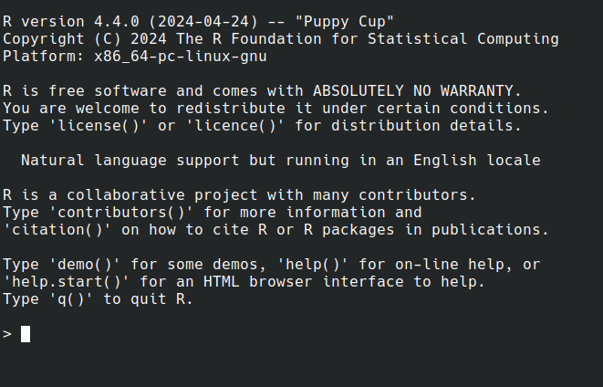
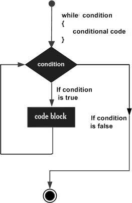

```{r echo=FALSE, eval=FALSE}
# Author: Debasish Mukherjee
# Date: 03.09.2024
# Version: 1.0
# Course:  Basic R Programming Course by CECAD Bioinformatics Facility in Sep. 2024.
# Description: This file contains the slides for the day 1 presentation which will 
# later be modified by Ali and Ulrike. 

```


```{css echo=FALSE}
.panelset {
   --panel-tab-foreground: grey;
   --panel-tab-active-foreground: #0051BA;
   --panel-tab-hover-foreground: #d22;
   --panel-tab-inactive-opacity: 0.5;
   --panel-tabs-border-bottom: #ddd;
   --panel-tab-font-family: Arial;
}

.footer {
  color: var(--footer_grey);
  font-size: 0.5em;
  position: absolute;
  bottom: 0;
  left: 0;
  bottom: 0;
  border-top: 1px solid var(--cecad_blue);
  padding: 1rem 64px 1rem 64px;
}

.remark-inline-code { 
    font-family: 'Inconsolata', monospace; 
    color: #515151;
    //background-color: rgba(217, 5, 2, 0.2);
    border-radius: 2px; /* Making border radius */
    width: auto; /* Making auto-sizable width */
    height: auto; /* Making auto-sizable height */
    padding: 0px 2px 1px 2px;  /*Making space around letters */
    color: #818181;
    color: rgb(249, 38, 114);
}

```


```{r xaringan-panelset, echo=FALSE}
xaringanExtra::use_panelset()
xaringanExtra::use_tile_view()
xaringanExtra::use_extra_styles()
xaringanExtra::use_progress_bar(color = "#0051BA", location = "top")
```

# Slides & Code

.right-column[
### `r fontawesome::fa("github")` git repo

[Basic_R_course_CGA](https://github.com/CECADBioinformaticsCoreFacility/Basic_R_course_CGA)

`git clone https://github.com/CECADBioinformaticsCoreFacility/Basic_R_course_CGA.git`

### Slides Directly

[https://cecadbioinformaticscorefacility.github.io/Basic_R_course_CGA/](https://cecadbioinformaticscorefacility.github.io/Basic_R_course_CGA/)

]

.left-column[
```{r, echo=FALSE, fig.width=2, fig.height=2, fig.align='center'}
#fig.width=2, fig.height=2,
plot(qrcode::qr_code("https://github.com/RichardJActon/performantR"))
```

- [*p*] presenter view
- [*o*] overview
- [*f*] fullscreen
- [*h*] help/more

]

???

This is just an example of Notes #DM1


class: inverse, center, middle

# Introduction to R and Basic Programming Concepts


---
class: inverse, center, middle

# History of the R Programming  Language

An Overview Inspired by 

https://en.wikipedia.org/wiki/S_(programming_language)

Federico M. Giorgio et al.: The R Language: An Engine for Bioinformatics and Data Science.  Life 2022, 12(5), 648; https://doi.org/10.3390/life12050648 

Timothy L. Staples: Expansion and evolution of the R programming language. Royal Society Open Science 2023 https://doi.org/10.1098/rsos.221550
  
  
Ulrike Göbel
---
# The Lifeline of R
<div style="float:right; margin-left: 40px;">
```{r, echo=FALSE,out.width="70%"}
knitr::include_graphics("../images/lifeline.png")
```
</div>


-    R is an offspring of the **S programming language**
--

    + a pioneer in **making exploratory data analysis easy**
    
    + hiding clumsy FORTRAN implementations in simpler functions
    
    + easily accessible function documentation
--

    + interactive **graphics** devices

--
-   **from 1993 on, R started to branch off** into an independent, free(!) language

---
# The Lifeline of R
<div style="float:right; margin-left: 40px;">
```{r, echo=FALSE,out.width="70%"}
knitr::include_graphics("../images/lifeline.png")
```
</div>


-   from the **turn of the century** on, R became one of the major languages used in **Bioinformatics**, boosted by the **Bioconductor project**, which is largely R-based

--

-   the second large application domain of current R is **general Big Data analysis**

--

-   from the second decade of the new century on, the **RStudio (now: Posit)** company gained increasing influence on the evolution of the language

---
# The Lifeline of R
<div style="float:right; margin-left: 40px;">
```{r, echo=FALSE,out.width="70%"}
knitr::include_graphics("../images/lifeline.png")
```
</div>


-   **RStudio** is influential because

--

    + its **Integrated Development Environment (IDE)** is increasingly used by people doing data analysis with R

--
    + Hadley Wickham, the main developer of the **tidyverse ecosystem of R packages** is located at RStudio/Posit and is heavily pushing the adoption of the **special programming style** which comes with it

---
# The Lifeline of R
<div style="float:right; margin-left: 40px;">
```{r, echo=FALSE,out.width="70%"}
knitr::include_graphics("../images/lifeline.png")
```
</div>


-   **"Base R" style:** 

    + "base" R functionality comes with R itself,
without installing any other packages

    + many "base" packages share a traditional style
--

    + relatively few functions
  
    + each function can be tuned by parameters for a range of related tasks
--

    + main operation = the invocation of individual functions
--

    + emphasis on **"all R objects are vectors"**

---

# The Lifeline of R
<div style="float:right; margin-left: 40px;">
```{r, echo=FALSE,out.width="70%"}
knitr::include_graphics("../images/lifeline.png")
```
</div>


-   **Tidyverse style**

    + **emphasis on data tables** (2D)
--

    + many specialized functions
    + main operation = converting data tables step-wise, by chaining output and input of functions through the **piping operator**
    
--

-   Unclear whether the language will separate into **two dialects**,   
or whether the two approaches will **merge into a new paradigm** with time

---
# A Biologist's View on the Evolution of R
<div style="float:right; margin-left: 40px;">
```{r, echo=FALSE,out.width="80%"}

```
</div>


-   Timothy Staples collected **R function names used in GitHub repositories from 2014 to 2021**

-   Functions were classified by provenance
    + coming with base R
    + defined in tidyverse packages
    + other
--

-   The graph plots the **slope of frequency of usage over time** versus the probability of use at the end of the period of observation.

---
# A Biologist's View on the Evolution of R
<div style="float:right; margin-left: 40px;">
```{r, echo=FALSE,out.width="80%"}

```
</div>


-   Trends:

    + Some rare functions may be on the way to extinction (negative slope)
--
 
    + Many base R functions have slopes around zero (no change in usage)
    + Many of them are still heavily used at the end of the observation period
--

    + **A core part of base R is definitely stable!**

---
# A Biologist's View on the Evolution of R
<div style="float:right; margin-left: 40px;">
```{r, echo=FALSE,out.width="80%"}

```
</div>


-   However

    + Nearly all tidyverse functions do have a positive slope (usage increases)
    
    + Nearly all strongly increasing functions are tidyverse functions
--

    + **There is definitely a transition going on in the community**

---
# You Will See Both Styles in the Course
```{r, echo=FALSE,out.width="70%"}

```


---

class: inverse, center, middle

# Session 1: Basic Programming in R

---

# Interacting R


.panelset.sideways[
.panel[.panel-name[R CLI]


]

.panel[.panel-name[R IDE]

- RStudio
- Jupyter Notebook
- Visual Studio
- Eclipse
- ...

]

.panel[.panel-name[RStudio]


]

.panel[.panel-name[R Script]


```{r eval=FALSE}
# Load data
data("iris")

# display data sample
head(iris)

# get statistics
summary(iris)

# get plot
boxplot(Petal.Length ~ Species, data = iris, col=c(1:3))
```


```{bash eval=FALSE}
# Running the script
{{Rscript boxplot.R}}
```


]
.panel[.panel-name[R help]
```{r eval=FALSE}
? [function]

help([function])

example([function])

demo([topic])

browseVignettes([package])

search()

data()

```

]
]

???
Page 6

Save script in *.R / *.Rmd / *.qmd 

Rmd file description

Initialize project
---
# Variables

.pull-left[

- Variables are containers for storing data values.

- R does not have a command for declaring a variable

- A variable is created the moment you first assign a value to it.

- Assignment operator `<-`/ `=` can be used for assigning a value


]

--

.pull-right[
```{r tidy=FALSE} 
# This is a comment

name <- "John"    # This is also a comment
age <- 40
name

name <- "Tom"
print (name)

```
]

```{r echo=FALSE}

```

???
Page 7

'#' Comment and its importance


---

# Variable Names

A variable can have a short name (like x and y) or a more descriptive name (age, carname, total_volume). Rules for R variables are:

- A variable name must start with a letter and can be a combination of letters, digits, period(.)
    and underscore(_). 

--

.pull-left[
```{r eval=FALSE}
# Allowed variable names:
myvar    <- "John"
my_var   <- "John"
myVar    <- "John"
MYVAR    <- "John"
myvar2   <- "John"
myvar_2. <- "John"
{{.myvar   <- "John"}}
```
]
.pull-right[
```{r eval=FALSE}
# Not Allowed variable names:
2myvar  <- "John"  # starts with a number
.2myvar <- "John"  # starts with a '.' number
my-var  <- "John"  # special character
my var  <- "John"  # space
_my_var <- "John"  # starts with a '_'
my_var% <- "John"  # special character
TRUE    <- "John"  # reserved words
```
]

???
Page 8

Variables are case sensitive
---

class: animated slideInRight fadeOutLeft
# Data Types

.pull-left[

| Data Type      | Example           |
|----------------|-------------------|
| Logical        |  TRUE / FLASE     |
| Numeric        |  1.3, 5, 4.2      |
| Integer        |  1L, 0L, 4L       |
| Complex        |  2+3i             |
| Character      |  "We are Learning"|
]

--

.pull-right[
```{r tidy=FALSE, xaringan-extra-styles}
x <- 10.5

x <- 1000L

x <- 9i + 3

x <- "R is exciting"

x <- TRUE

# Evaluete data type
class(x)  #<<

```
]
---
# R Data Structure

The variables are assigned with R-Objects and the data type of the R-object becomes the data type of the variable. There are many types of R-objects. The frequently used ones are −

.panelset.sideways[
.panel[.panel-name[Vectors]

```{r}
# Create a vector.
alphabets <- c('a','b',"c","d")

# Print the vector.
print(alphabets)
```
]
.panel[.panel-name[Lists]
```{r}
# Create a list.
list1 <- list(c(2,5,3),21.3,sin)

# Print the list.
print(list1)
```
]
.panel[.panel-name[Factors]

```{r}
# Create a vector.
apple_colors <- c('green','green','yellow','red','red','red','green')

# Create a factor object.
factor_apple <- factor(apple_colors)

# Print the factor.
print(factor_apple)
```
]
.panel[.panel-name[Matrices]

```{r}
# Create a matrix.
M = matrix( c('a','a','b','c','b','a'), 
            nrow = 2, 
            ncol = 3, 
            byrow = TRUE)

# Print the matrix
print(M)
```
]
.panel[.panel-name[Arrays]

```{r}
# Create an array.
a <- array(c('green','yellow'),dim = c(1,3,2))

# Print the array
print(a)
```
]
.panel[.panel-name[Data Frames]
```{r}
# Create the data frame.
BMI <- 	data.frame(
   gender = c("Male", "Male","Female"), 
   height = c(152, 171.5, 165), 
   weight = c(81,93, 78),
   Age = c(42,38,26)
)

# Print the data frame
print(BMI)
```
]
]

???
Page 10

1. What is it?
2. How to create?
3. How to access?

- Most Basic R-object is Vector

- Vectors must have their values all of the same mode/type [“atomic” structures ]

- use c() to combine

============

-  list in R can contain many different data types inside it

============

- Factors are used to categorize data

- you cannot change the value of a specific item if it is not already specified in the factor.

matrices or more generally arrays are multi-dimensional generalizations of vectors

---
# Operators

.panelset[
.panel[.panel-name[Arithmetic]

| Operator | Name                               | Example     |
| :---:    | :--------:                         | :---:       |
|   +      | Addition                           | `x + y`     | 
|   -      | Subtraction                        | `x - y`     |
|   *      |	Multiplication                    | 	`x * y`   |
|   /      |	Division                          |	`x / y`     |
|   ^      |	Exponent                          | 	`x ^ y`   |
|   %%     |	Modulus (Remainder from division) |	`x %% y`    |
|   %/%    |	Integer Division                  |	`x%/%y`     |
]
.panel[.panel-name[Relational]

|Operator |	Name |	Example |
| :---:    | :--------:              | :---:      |
|   ==    |	Equal                    |	`x == y` 	|
|   !=    |	Not equal                |	`x != y` 	|
|   >     |	Greater than             |	`x > y`   |	
|   <     | Less than                |  `x < y`   |	
|   >=    |	Greater than or equal to |	`x >= y`  |
|   <=    |	Less than or equal to    |	`x <= y`  |

]
.panel[.panel-name[Logical]

|  Operator  |	Description                                                                   |
|  :---:    | :--------:              |
|   &        |	Element-wise Logical AND operator. It returns TRUE if both elements are TRUE  |
|   &&       | 	Logical AND operator - Returns TRUE if both statements are TRUE               |
|   &#124;        | 	Elementwise- Logical OR operator. It returns TRUE if one of the statement is TRUE |
|   &#124;&#124;       | 	Logical OR operator. It returns TRUE if one of the statement is TRUE. |
|   !        | 	Logical NOT - returns FALSE if statement is TRUE |


]
.panel[.panel-name[Assignment]
```{r}
my_var <- 3

my_var <<- 3

3 -> my_var

3 ->> my_var

assign("my_var", c(10.4, 5.6, 3.1, 6.4, 21.7))

my_var # print my_var


```

]
.panel[.panel-name[Miscellaneous]

| Operator |	Description |	Example |
|  :---:    | :--------: | :--------: |
| :    |	Creates a series of numbers in a sequence  |	`x <- 1:10` |
| %in% |	Find out if an element belongs to a vector |	`x %in% y` |
| %\*%  |	Matrix Multiplication                      |	`x <- Matrix1 %*% Matrix2` |
]
]


---
# R - Decision making
.panelset[
.panel[.panel-name[`if`]

.pull-left[
-   `if` statement
```{r}
x <- 30L
if(is.integer(x)) {
   print("X is an Integer")
}
```
]
.pull-right[

]
]
.panel[.panel-name[if...else]

.pull-left[
-   `if...else` statement
```{r}
x <- c("what","is","truth")

if("Truth" %in% x) {
   print("Truth is found")
} else {
   print("Truth is not found")
}
```
]
.pull-right[

]
]
.panel[.panel-name[switch]

.pull-left[
-   `switch` statement
```{r}
x <- switch(
   3,
   "first",
   "second",
   "third",
   "fourth"
)
print(x)
```

]
.pull-right[

]
]
]

---
# R-Loops

.panelset[
.panel[.panel-name[for Loop]

.pull-left[
-   `for` Loop
```{r}
v <- LETTERS[1:4]
for ( i in v) {
   print(i)
}
```
]
.pull-right[

]
]

.panel[.panel-name[while Loop]

.pull-left[
-   `while` Loop
```{r}
v <- c("Hello","while loop")
cnt <- 2

while (cnt < 7) {
   print(v)
   cnt = cnt + 1
}
```
]
.pull-right[

]
]

.panel[.panel-name[repeat Loop]

.pull-left[
-   `repeat` Loop
```{r}
v <- c("Hello","loop")
cnt <- 2

repeat {
   print(v)
   cnt <- cnt+1
   
   if(cnt > 5) {
      break
   }
}
```
]
.pull-right[

]
]

.panel[.panel-name[next statement]

.pull-left[
-   `next` statement
```{r}
v <- LETTERS[1:6]
for ( i in v) {
   
   if (i == "D") {
      next
   }
   print(i)
}
```
]
.pull-right[
<!-- {width=25%} -->

```{r, echo=FALSE, out.width="65%"}
knitr::include_graphics("../images/r_next_statement.jpg")
```
]
]

.panel[.panel-name[break statement]

.pull-left[
-   `break` statement
```{r}
v <- c("Hello","loop")
cnt <- 2

repeat {
   print(v)
   cnt <- cnt + 1
	
   if(cnt > 5) {
      break
   }
}
```
]
.pull-right[

]
]
]


---
# R-Functions

``` r
function_name <- function(arg_1, arg_2, ...) {
   Function body
   print()
}
```


__Function Name__ − This is the actual name of the function. It is stored in R environment as an object with this name.

__Arguments__ − An argument is a placeholder. When a function is invoked, you pass a value to the argument. Arguments are optional; that is, a function may contain no arguments. Also arguments can have default values.

__Function Body__ − The function body contains a collection of statements that defines what the function does.

__Return Value__ − The return value of a function is the last expression in the function body to be evaluated.


---
# R packages

`.libPaths()`

`library()`

`install.packages()` ==\> CRAN

`install.packages(path_to_file, repos = NULL, type="source")` ==\> Local

`BiocManager::install("DESeq2")`  ==\> bioconductor

--

```{r bioconductor, echo=FALSE, message=FALSE, warning=FALSE, fig.height=4}
library(tidyverse)
read_tsv("https://bioconductor.org/packages/stats/bioc/bioc_pkg_stats.tab") %>%
  filter(Year != 2024) %>%
  select(Year, Nb_of_downloads) %>%
  group_by(Year) %>%
  summarise(sum = sum(Nb_of_downloads) / 1000000) %>%
  ggplot(mapping = aes(x = Year, y = sum)) +
  geom_area(fill="#0051BA", alpha=0.4) +
  geom_line(color="#0051BA", size=2) +
  geom_point(size=3, color="#0051BA") +
  scale_x_continuous(breaks = 2009:2023) +
  labs(x = NULL, y = "Downloads / year (millions)", 
       title = "Bioconductor package downloads / year over time")
```

---
class: inverse, center, middle

# Session 2: Data Entry and Data Management
---

# Data Import and Export

`read.csv`, `write.csv`, `subset()`

`read.xlsx`[**openxlsx**]


---
# Data Reshaping
.panelset[
.panel[.panel-name[dataframe]
```{r}
# Create vector objects.
address <- data.frame(
city = c("Cologne","Frankfurt","Ulm","Mainz"),
state = c("NRW","Hesse","BW","RLP"),
stringsAsFactors = FALSE
)

# Create vector
zipcode <- c(33602,98104,06161,80294)

# Create another data frame with similar columns
new.address <- data.frame(
   city = c("Lowry"),
   state = c("CO"),
   zipcode = c("80230"),
   stringsAsFactors = FALSE
)

```
]
.panel[.panel-name[cbind()]

```{r}

# Combine above vector into one data frame.
address <- cbind(address,zipcode)

# Print the data frame.
print(address)

```
]

.panel[.panel-name[rbind()]
```{r}

# Combine rows form both the data frames.
all.addresses <- rbind(address,new.address)

# Print the result.
print(all.addresses)
```
]

.panel[.panel-name[merge()]

]

.panel[.panel-name[apply()]
.pull-left[
```{r apply}
my.matrx <- matrix(c(1:5, 11:15, 21:25), nrow = 5, ncol = 3)
my.matrx

apply(my.matrx, 1, sum) # rows

apply(my.matrx, 2, sum) # columns
```
]
.pull-right[
```{r apply2, eval=FALSE}
lapply()  #  list in list out

sapply()  # "s"implified lapply()

vapply()  # similar to sapply()

tapply()  # calculating summary statistics

mapply()  #  multiple list or vector
```

]

]

.panel[.panel-name[melt()]
]

.panel[.panel-name[cast()]
]

]

---
# Data Reshaping with `dplyr`

.panelset[
.panel[.panel-name[filter()]
```{r filter}
iris |> 
   filter(Sepal.Length > 5) |>
   head()
```

]

.panel[.panel-name[select()]
```{r select}
iris |> 
   filter(Sepal.Length > 5) |>
   select(Sepal.Length, Petal.Length, Species) |>
   head()
```

]

.panel[.panel-name[mutate()]

```{r mutate}
iris |> 
   filter(Sepal.Length > 5) |>
   select(Sepal.Length, Petal.Length, Species) |>
   mutate(SePa.Length=Sepal.Length+Petal.Length) |>
   head()
```

]

.panel[.panel-name[arrange()]
```{r arrange}
iris |> 
   filter(Sepal.Length > 5) |>
   select(Sepal.Length, Petal.Length, Species) |>
   mutate(SePa.Length=Sepal.Length+Petal.Length) |>
   arrange(desc(Sepal.Length)) |>
   head()
```

]


.panel[.panel-name[summarise()]
```{r summerise}
iris |> 
   filter(Sepal.Length > 5) |>
   select(Sepal.Length, Petal.Length, Species) |>
   mutate(SePa.Length=Sepal.Length+Petal.Length) |>
   arrange(desc(Sepal.Length)) |> 
   summarise(mean = mean(Petal.Length), n = n())
```

]
.panel[.panel-name[group_by()]
```{r groupby}
iris |> 
   filter(Sepal.Length > 5) |>
   select(Sepal.Length, Petal.Length, Species) |>
   mutate(SePa.Length=Sepal.Length+Petal.Length) |>
   arrange(desc(Sepal.Length)) |> 
   group_by(Species) |>
   summarise(mean = mean(Petal.Length), n = n())
```

]
]
---
class: inverse, center, middle

# Session 3: Creating Graphics
---
# Base Graphics
.panelset.sideways[
.panel[.panel-name[data]
```{r}
## Load data
data("iris")

head(iris)
```
]

.panel[.panel-name[Scatterplot]
.pull-left[
```{r, eval=FALSE}
# Here, we plot Petal.Length 
# against Sepal.Length

# plot() expects vectors
# (individual data columns):
plot(x=iris$Petal.Length, 
     y=iris$Sepal.Length, 
     pch=19, # symbol = bullet
     col=2 # color = red
     )
## Default color indices:
## black=1, red=2, green=3

## Simpler notation:
with(iris,
     plot(Sepal.Length,
          Petal.Length
     )

## Put a grid:
grid()
```
]
.pull-right[
```{r Scatterplot1, echo=FALSE}
plot(x=iris$Petal.Length, y=iris$Sepal.Length, pch=19, col=2)
grid()
```
]
]
.panel[.panel-name[Identify Points]
```{r identify_points, echo = FALSE}
my_points <- c(15,  16,  19, 107) 
```
.pull-left[
```{r, eval=FALSE}
plot(iris$Petal.Length,
     iris$Sepal.Length, pch=19, 
     col=2)

# click on points of interest
# quit identify() with right mouse button
my_points <- 
  identify(x=iris$Petal.Length,
           y=iris$Sepal.Length)
```
.verytiny-code[
```{r Scatterplot4}
iris[my_points,
     c("Petal.Length",
       "Sepal.Length")
     ]
```
]
]
.pull-right[
```{r, echo=FALSE, out.width="120%"}

```

]
]


.panel[.panel-name[Annotation -- Text]
.pull-left[
```{r, eval=FALSE}
plot(iris$Petal.Length, 
     iris$Sepal.Length, 
     pch=19, col=2)

# place text at an (x,y) point:
text(x=1.2,y=5.8,"outlier!",
     ## text should start
     ## exactly at (x,y)
     cex=2,adj=c(0,0) 
     )
```
]
.pull-right[
```{r Scatterplot3, echo=FALSE}
plot(iris$Petal.Length, 
     iris$Sepal.Length, 
     pch=19, col=2)

# place text at an (x,y) point:
text(x=1.2,y=5.8,"outlier!",
     ## text should start
     ## exactly at (x,y)
     cex=2,adj=c(0,0) 
                       
     )
```

]
]
.panel[.panel-name[Annotation -- abline]
.pull-left[
.tiny-code[
```{r, eval=FALSE}
plot(iris$Petal.Length, 
     iris$Sepal.Length, 
     pch=19, col=2)
# draw a line
# with an intercept a 
# and a slope b
abline(a=4.2, b=0.5)

# the true regression line
abline(lm(Sepal.Length ~ Petal.Length,
          iris), 
       lwd=3)

# a horizontal line at y = 6 
abline(h = 6, col = "blue")

# a vertical line at x = 4 
abline(v = 4, col = "yellow", 
       lwd=2, lty=2)

# set or query 
# graphical parameters:
?par

# color names:
colors()
```
]
]
.pull-right[
```{r Scatterplot2, echo=FALSE,out.width="110%"}
plot(iris$Petal.Length, iris$Sepal.Length, pch=19, col=2)
abline(a=4.2, 0.5)
abline(lm(Sepal.Length ~ Petal.Length,iris),
       lwd=3)

abline(h = 6, col = "blue")
abline(v = 4, col="yellow", lwd=2, lty=2)
```
]
]
.panel[.panel-name[Line Graph]
.pull-left[
```{r, eval=FALSE}
plot(1:length(iris$Sepal.Length), ## x = index! 
     iris$Sepal.Length,  col=3, 
     type = 'l')
```
]
.pull-right[
```{r LineGraph, echo=FALSE, out.width="110%"}
plot(1:length(iris$Sepal.Length), 
     iris$Sepal.Length, col=3, 
     type = 'l')
```

]
]
.panel[.panel-name[Overplotting]
.pull-left[
```{r, eval=FALSE}
## Note: 
## now x is an index (row number)
plot(1:length(iris$Sepal.Length), 
     iris$Sepal.Length, col=3, 
     type = 'l')

## add a scatterplot to the graph
points(1:length(iris$Sepal.Length),
       iris$Sepal.Length, 
       pch=19, col="yellow"
       )

## add another line graph,
## now with reversed index order:
lines(length(iris$Sepal.Length):1,  
     iris$Sepal.Length, 
     col="lightblue", 
     type = 'l')

```
]
.pull-right[
```{r Overplotted, echo=FALSE, out.width="110%"}
plot(1:length(iris$Sepal.Length), 
     iris$Sepal.Length, col=3, 
     type = 'l')
points(1:length(iris$Sepal.Length),
       iris$Sepal.Length, 
       pch=19, col="yellow"
       )
lines(length(iris$Sepal.Length):1, ## x = index! 
     iris$Sepal.Length, 
     col="lightblue", 
     type = 'l')

```

]
]

.panel[.panel-name[Histogram]
.pull-left[
```{r, eval=FALSE}
range(iris$Petal.Length)
##[1] 1.0 6.9
range(iris$Sepal.Length)
##[1] 4.3 7.9

hist(iris$Petal.Length,
     # 1=red, 2=green, 3="blue"
     col=rgb(1, 0, 0, 
             alpha=0.5),
     xlim=c(1, 7.9),
     xlab="Organ Length",
     main = "Organ Distributions"
)
hist(iris$Sepal.Length,add=TRUE,
     col=rgb(0,0,1,alpha=0.5)
)
legend("topright", 
       legend=c("Petal", "Sepal"), 
       fill=c(rgb(1, 0, 1, alpha=0.5), 
              rgb(0, 0, 1, alpha=0.5))
       )
```

]
.pull-right[
```{r, echo=FALSE, out.width="120%"}

```
]
]
.panel[.panel-name[Boxplot]
```{r Boxplot, out.width="50%"}
# Here, we plot Petal.Length across Species to check the distribution
boxplot(Petal.Length ~ Species, data = iris, col=c(1:3))
```

]
.panel[.panel-name[Bar Chart]
.pull-left[
```{r, eval=FALSE}
# Typical barplot to check the mean 
# of Petal.Length across species
df <- aggregate(
        iris[,1:4], 
        by = list(iris$Species), 
        FUN = mean)

barplot(Petal.Length ~ Group.1, 
        data = df,
        xlab = c('Species'), 
        ylab = c('Petal Length'), 
        col=c(1:3)
        )
```
```{r, echo=FALSE}
df <- aggregate(iris[,1:4], by = list(iris$Species), FUN = mean)
```


.verytiny-code[
```{r}
df
```
]
]

.pull-right[
```{r BarChart, echo=FALSE, out.width="120%", warning=FALSE, message=FALSE}
df <- aggregate(iris[,1:4], by = list(iris$Species), FUN = mean)
oldpar <- par()
par(oma=c(0,0,0,0))
barplot(Petal.Length~Group.1, data = df,xlab = c('Species'), ylab = c('Petal Length'), col=c(1:3))
par(oldpar)
```
]
]
.panel[.panel-name[Pie Chart]
```{r PieChart}
pie(df$Petal.Length, labels =df$Group.1)
```
]
]

---


# Introduction to ggplot2

.panelset.sideways[

.panel[.panel-name[What is ggplot2?]

.pull-left[

**ggplot2** is a powerful and flexible **data visualization** package in R based on **The Grammar of Graphics**. It allows users to create complex and customizable plots easily by layering graphical elements.

- **Grammar of Graphics**: ggplot2 builds plots using components like data, aesthetics, geometries (geoms), scales, and more.  
- **Declarative Syntax**: You specify what you want to plot, and ggplot2 handles the details.
  
- **Applications**: ggplot2 is widely used for exploratory data analysis (EDA), scientific visualization, and producing publication-quality figures.
  
]

.pull-right[

<div class="image-with-caption">
  
  <p class="caption"><font size="3"><b>source:</b> https://r.qcbs.ca/workshop03/book-en/grammar-of-graphics-gg-basics.html</font></p>
</div>

]

]

.panel[.panel-name[ggplot2 Basics]

.pull-left[

1. **Data**: The dataset you want to visualize.  
2. **Aesthetics (aes)**: Mappings between variables and visual properties like x, y, color, size.  
3. **Geometries (geoms)**: The type of plot, e.g., points, lines, bars.
4. **Faceting**: Split data into subplots based on a variable.  
5. **Scales**: Control the mapping between data and aesthetics.  
6. **Themes**: Customize the appearance of plots (e.g., fonts, background color). 

]

.pull-right[

<div class="image-with-caption">
  
  <p class="caption"><font size="3"><b>source:</b> https://www.rforecology.com/post/a-simple-introduction-to-ggplot2/</font></p>
</div>

]

]

.panel[.panel-name[Common Geometries]

.pull-left[

- **geom_point()**: Scatter plots, used for visualizing relationships between continuous variables.
- **geom_line()**: Line charts, ideal for trends over time.
- **geom_bar()**: Bar charts, used for comparing categories.
- **geom_histogram()**: Visualize the distribution of a single continuous variable.
- **geom_boxplot()**: Display summary statistics and visualize the spread of data.

]

.pull-right[

<div class="image-with-caption">
  
  <p class="caption"><font size="3"><b>source:</b> https://r-graph-gallery.com/</font></p>
</div>

]

]

.panel[.panel-name[Creating a Plot in ggplot2]

.pull-left[

**Steps to Create a Plot**:
1. **Define ggplot object**: Start by calling `ggplot()` and specifying your dataset.
2. **Add aesthetics**: Map variables to axes and other properties using `aes()`.
3. **Add geometries**: Choose the type of plot (e.g., scatter plot with `geom_point()`).
4. **Customize**: Adjust scales, titles, labels, and themes.

]

.pull-right[

```{r fig.height=4, fig.width=6}
# Example: Scatter plot of Sepal Length vs Sepal Width
library(ggplot2)

ggplot(iris,
       aes(x = Sepal.Length,
           y = Sepal.Width,
           color = Species)) +
  geom_point(size = 3) +
  ggtitle("Sepal Length vs Sepal Width") +
  xlab("Sepal Length (cm)") +
  ylab("Sepal Width (cm)") +
  theme_minimal()
```

]
]

.panel[.panel-name[Faceting in ggplot2]

.pull-left[

**Faceting** allows you to split your data into multiple subplots based on one or more categorical variables.

- **facet_wrap()**: Create a separate plot for each level of a categorical variable.
- **facet_grid()**: Create a grid of plots for combinations of two variables.

]

.pull-right[

```{r fig.width=6, fig.height=4}
# Example: Faceted scatter plot by Species
ggplot(iris, 
       aes(x = Sepal.Length,
           y = Sepal.Width)) +
  geom_point(size = 3) +
  facet_wrap(~ Species) +
  ggtitle("Faceted Scatter Plot by Species") +
  theme_minimal()
```

]

]

.panel[.panel-name[Customizing Plots]

.pull-left[

You can customize many aspects of a **ggplot2** plot:

- **Titles and Labels**: Use `ggtitle()`, `xlab()`, and `ylab()` to set titles and axis labels.
- **Themes**: Control plot appearance using built-in themes like `theme_minimal()`, `theme_bw()`, or create custom themes.
- **Colors**: Use `scale_color_manual()` or `scale_fill_manual()` to set custom colors.
- **Legends**: Adjust legend position and appearance with `theme()` settings.

]

.pull-right[

```{r fig.width=6, fig.height=4}
# Example: Customizing a scatter plot
ggplot(iris, aes(x = Petal.Length, y = Petal.Width, color = Species)) +
  geom_point(size = 4) +
  ggtitle("Petal Length vs Petal Width") +
  theme_minimal() +
  theme(
    plot.title = element_text(hjust = 0.5),
    legend.position = "bottom"
  )
```


]

]

.panel[.panel-name[Saving Your Plot]

.pull-left[

You can save your ggplot2 visualizations as image files with the **ggsave()** function. It supports various file formats like PNG, PDF, JPEG, and more.

- **ggsave("plot.png")**: Save the last plot as a PNG file.
- You can specify dimensions, resolution (dpi), and file format.

]

.pull-right[

```{r}
# Example: Save the current plot to a PNG file
ggsave("scatter_plot.png",
       width = 8,
       height = 6,
       dpi = 300)
```

This saves the current ggplot as a high-resolution PNG image with specified dimensions.
]

]

]


---
# Graphics with `ggplot2`

.panelset.sideways[

.panel[.panel-name[data]

```{r}
library(dplyr)
## Load data
data("iris")
head(iris)
```

]

.panel[.panel-name[Scatterplot]

.pull-left[
```{r  fig.show="hide"}
# Scatterplot: Sepal Length vs Sepal Width
library(ggplot2)

ggplot(iris, aes(x = Sepal.Length,
                 y = Sepal.Width,
                 color = Species)) +
  
  geom_point(size = 3) +
  ggtitle("Scatterplot: Sepal Length vs Sepal Width") +
  
  xlab("Sepal Length (cm)") +
  
  ylab("Sepal Width (cm)") +
  
  geom_text(aes(x = 5, y = 3.5, label = "Annotated Text"), color = "red", size = 5) +
  
  theme_minimal()


# annotate a specific coordinate on the plot with a custom text
# geom_text(aes(x = 5, y = 3.5, label = "Annotated Text"), color = "red", size = 5)

# add trend line
# geom_smooth(method = "lm", se = FALSE)

# add abline
# geom_abline(intercept = 0, slope = 1, linetype = "dashed")

#?geom_abline

```
]

.pull-right[
```{r Scatterplot_ggplot2, echo=F}
# Scatterplot: Sepal Length vs Sepal Width
library(ggplot2)

ggplot(iris, aes(x = Sepal.Length, y = Sepal.Width, color = Species)) +
  geom_point(size = 3) +
  ggtitle("Scatterplot: Sepal Length vs Sepal Width") +
  xlab("Sepal Length (cm)") +
  ylab("Sepal Width (cm)") +
  theme_minimal()
```
]
]

.panel[.panel-name[Line Graph]


.pull-left[
```{r fig.show="hide"}
# Line Graph: Petal Length by Sepal Length
ggplot(iris, aes(x = Sepal.Length, y = Petal.Length, color = Species)) +
  geom_line() +
  ggtitle("Line Graph: Petal Length by Sepal Length") +
  xlab("Sepal Length (cm)") +
  ylab("Petal Length (cm)") +
  theme_minimal()
```
]

.pull-right[
```{r LineGraph_ggplot2, echo=F}
# Line Graph: Petal Length by Sepal Length
ggplot(iris, aes(x = Sepal.Length, y = Petal.Length, color = Species)) +
  geom_line() +
  ggtitle("Line Graph: Petal Length by Sepal Length") +
  xlab("Sepal Length (cm)") +
  ylab("Petal Length (cm)") +
  theme_minimal()
```
]


]

.panel[.panel-name[Histogram]

.pull-left[
```{r fig.show="hide"}
# Histogram: Distribution of Sepal Length
ggplot(iris, 
       aes(x = Sepal.Length, 
           fill = Species)) +
  geom_histogram(binwidth = 0.3, 
                 position = "dodge") +
  ggtitle("Histogram: Distribution of Sepal Length") +
  xlab("Sepal Length (cm)") +
  ylab("Count") +
  theme_minimal()
```
]

.pull-right[
```{r Histogram_ggplot2, echo=F}
# Histogram: Distribution of Sepal Length
ggplot(iris,
       aes(x = Sepal.Length,
           fill = Species)) +
  geom_histogram(binwidth = 0.3,
                 position = "dodge") +
  ggtitle("Histogram: Distribution of Sepal Length") +
  xlab("Sepal Length (cm)") +
  ylab("Count") +
  theme_minimal()
```
]


]

.panel[.panel-name[Density]

.pull-left[
```{r fig.show="hide"}
# Density Plot: Sepal Length by Species
ggplot(iris,
       aes(x = Sepal.Length,
           fill = Species)) +
  geom_density(alpha = 0.5) +
  ggtitle("Density Plot: Sepal Length by Species") +
  xlab("Sepal Length (cm)") +
  ylab("Density") +
  theme_minimal()
```
]

.pull-right[
```{r Density_ggplot2, echo=F}
# Density Plot: Sepal Length by Species
ggplot(iris,
       aes(x = Sepal.Length,
           fill = Species)) +
  geom_density(alpha = 0.5) +
  ggtitle("Density Plot: Sepal Length by Species") +
  xlab("Sepal Length (cm)") +
  ylab("Density") +
  theme_minimal()
```
]
]


.panel[.panel-name[Boxplot]


.pull-left[
```{r fig.show="hide"}
# Boxplot: Sepal Length by Species
ggplot(iris,
       aes(x = Species,
           y = Sepal.Length,
           fill = Species)) +
  geom_boxplot() +
  ggtitle("Boxplot: Sepal Length by Species") +
  xlab("Species") +
  ylab("Sepal Length (cm)") +
  theme_minimal()
```
]

.pull-right[
```{r Boxplot_ggplot2, echo=F}
# Boxplot: Sepal Length by Species
ggplot(iris,
       aes(x = Species,
           y = Sepal.Length,
           fill = Species)) +
  geom_boxplot() +
  ggtitle("Boxplot: Sepal Length by Species") +
  xlab("Species") +
  ylab("Sepal Length (cm)") +
  theme_minimal()
```
]


]

.panel[.panel-name[Bar Chart]

.pull-left[

```{r fig.show="hide"}
# Bar Chart: Species Counts
ggplot(iris,
       aes(x = Species,
           fill = Species)) +
  geom_bar() +
  ggtitle("Bar Chart: Species Counts") +
  xlab("Species") +
  ylab("Count") +
  theme_minimal()
```
]

.pull-right[
```{r BarChart_ggplot2, echo=F}
# Bar Chart: Species Counts
ggplot(iris,
       aes(x = Species,
           fill = Species)) +
  geom_bar() +
  ggtitle("Bar Chart: Species Counts") +
  xlab("Species") +
  ylab("Count") +
  theme_minimal()
```
]

]

.panel[.panel-name[Pie Chart]

.pull-left[
```{r fig.show="hide"}
# Pie Chart: Species Distribution
iris_summary <- iris %>%
  dplyr::count(Species) %>%
  dplyr::mutate(perc = n / sum(n) * 100)

ggplot(iris_summary, 
       aes(x = "", 
           y = perc, 
           fill = Species)) +
  geom_bar(stat = "identity", 
           width = 1) +
  coord_polar("y", 
              start = 0) +
  ggtitle("Pie Chart: Species Distribution") +
  theme_void()
```
]

.pull-right[
```{r PieChart_ggplot2, echo=F}
# Pie Chart: Species Distribution
iris_summary <- iris %>%
  dplyr::count(Species) %>%
  dplyr::mutate(perc = n / sum(n) * 100)

ggplot(iris_summary, aes(x = "", y = perc, fill = Species)) +
  geom_bar(stat = "identity", width = 1) +
  coord_polar("y", start = 0) +
  ggtitle("Pie Chart: Species Distribution") +
  theme_void()


```
]


]

]


---
class: inverse, center, middle

# Session 4: Descriptive Statistics
---
# What is Descriptive Statistics ?

descriptive statistics (in the broad sense of the term) is a branch of statistics 
aiming at summarizing, describing and presenting a series of values or a dataset.

Descriptive statistics is often the first step and an important part in any 
statistical analysis. It allows to check the quality of the data and it helps to
“understand” the data by having a clear overview of it. 

--

There exists many measures to summarize a dataset. They are broadly divided into
two types:

- Measures of Central Tendency and
- Measures of Variability


---
# Measures of Descriptive Statistics
.panelset.sideways[
.panel[.panel-name[Min, max, range]
```{r MinMax}
min(iris$Sepal.Length)

max(iris$Sepal.Length)

range(iris$Sepal.Length)
```

]
.panel[.panel-name[mean, median, mode]
```{r}
mean(iris$Sepal.Length)

median(iris$Sepal.Length)

table(iris$Sepal.Length) |>
  sort(decreasing = TRUE)
```
]
.panel[.panel-name[quartiles]
```{r quartile}
quantile(iris$Sepal.Length, 0.25) # first quartile

quantile(iris$Sepal.Length, 0.75) # third quartile

IQR(iris$Sepal.Length) # interquartile range 
```

]
.panel[.panel-name[Summary]
```{r summary}
summary(iris)
```
]
.panel[.panel-name[Plot]

]
.panel[.panel-name[standard deviation]
.pull-left[
```{r sd}
# standard deviation
sd(iris$Sepal.Length) 

# variance
var(iris$Sepal.Length) 
```
]
.pull-right[

]
]


```{r eval=FALSE, echo=FALSE}
.panel[.panel-name[skew & Kurtosis]
 __should I include?__
]
```

]
---
# Frequency/Cross/Contingency Tables

Cross-tabulation analysis, also known as contingency table analysis, is most often used to analyze categorical (nominal measurement scale) data.

At their core, cross-tabulations are simply data tables that present the results of the entire group of respondents, as well as results from subgroups of survey respondents. With them, you can examine relationships within the data that might not be readily apparent when only looking at total survey responses

--

.pull-left[
```{r ContingencyTable}
demo_data <- iris

demo_data$size <- ifelse(demo_data$Sepal.Length < median(demo_data$Sepal.Length),
  "small", "big"
)
table(demo_data$Species, demo_data$size)
```
]

--

.pull-right[
```{r mosaicPlot,echo=FALSE, out.width="70%"}
mosaicplot(table(demo_data$Species, demo_data$size),
  color = TRUE,
  xlab = "Species", # label for x-axis
  ylab = "Size" # label for y-axis
)
```
]
---
# Correlation
A correlation measures the relationship between two variables, that is, how they are linked to each other. In this sense, a correlation allows to know which variables evolve in the same direction, which ones evolve in the opposite direction, and which ones are independent.

--

Correlation is usually computed on two quantitative variables, but it can also be computed on two qualitative ordinal variables.

- Pearson correlation is often used for quantitative continuous variables that have a linear relationship

--

- Spearman correlation (which is actually similar to Pearson but based on the ranked values for each variable rather than on the raw data) is often used to evaluate relationships involving at least one qualitative ordinal variable or two quantitative variables if the link is partially linear

--

```{r Correlation}
cor(iris$Sepal.Length,iris$Sepal.Width, method = "pearson")

cor(iris$Sepal.Length,iris$Sepal.Width, method = "spearman")

# # improved correlation matrix
# library(corrplot)
# 
# corrplot(cor(dat),
#   method = "number",
#   type = "upper" # show only upper side
# )
```

---
# Correlation Test
a correlation coefficient different from `0` in the sample does not mean that the correlation is significantly different from `0` in the population. This needs to be tested with a hypothesis test—and known as the correlation test.

The null and alternative hypothesis for the correlation test are as follows:

- _H_<sub>0</sub> : ρ = 0 (meaning that there is no linear relationship between the two variables)
- _H_<sub>1</sub> : ρ ≠ 0 (meaning that there is a linear relationship between the two variables)

--

```{r CorrelationTest}
cor.test(iris$Sepal.Length,iris$Sepal.Width)
```


