```{r echo=FALSE, eval=FALSE}
# Author: Debasish Mukherjee
# Date: 03.09.2024
# Version: 1.0
# Course:  Basic R Programming Course by CECAD Bioinformatics Facility in Sep. 2024.
# Description: This file contains the slides for the day 2 presentation which will 
# later be modified by Ali and Ulrike. 

```


```{css echo=FALSE}
.panelset {
   --panel-tab-foreground: grey;
   --panel-tab-active-foreground: #0051BA;
   --panel-tab-hover-foreground: #d22;
   --panel-tab-inactive-opacity: 0.5;
   --panel-tabs-border-bottom: #ddd;
   --panel-tab-font-family: Arial;
}

.footer {
  color: var(--footer_grey);
  font-size: 0.5em;
  position: absolute;
  bottom: 0;
  left: 0;
  bottom: 0;
  border-top: 1px solid var(--cecad_blue);
  padding: 1rem 64px 1rem 64px;
}

.remark-inline-code { 
    font-family: 'Inconsolata', monospace; 
    color: #515151;
    //background-color: rgba(217, 5, 2, 0.2);
    border-radius: 2px; /* Making border radius */
    width: auto; /* Making auto-sizable width */
    height: auto; /* Making auto-sizable height */
    padding: 0px 2px 1px 2px;  /*Making space around letters */
    color: #818181;
    color: rgb(249, 38, 114);
}

```


```{r xaringan-panelset, echo=FALSE}
xaringanExtra::use_panelset()
xaringanExtra::use_extra_styles()
xaringanExtra::use_progress_bar(color = "#0051BA", location = "top")
```

# Slides & Code

.right-column[
### `r fontawesome::fa("github")` git repo

[Basic_R_course_CGA](https://github.com/CECADBioinformaticsCoreFacility/Basic_R_course_CGA)

`git clone https://github.com/CECADBioinformaticsCoreFacility/Basic_R_course_CGA.git`

### Slides Directly

[https://cecadbioinformaticscorefacility.github.io/Basic_R_course_CGA/](https://cecadbioinformaticscorefacility.github.io/Basic_R_course_CGA/)

]

.left-column[
```{r, echo=FALSE, fig.width=2, fig.height=2, fig.align='center'}
#fig.width=2, fig.height=2,
plot(qrcode::qr_code("https://github.com/RichardJActon/performantR"))
```

- [*p*] presenter view
- [*o*] overview
- [*f*] fullscreen
- [*h*] help/more

]

---
class: inverse, center, middle

# Statistical Analysis in R

---

class: inverse, center, middle

# Session 1: Inferential Statistics - Part 1

---
# Chi-square test

Chi-square test of independence tests whether there is a relationship between two categorical variables. The null and alternative hypotheses are:

- _H_<sub>0</sub> : the variables are independent, there is no relationship between the two categorical variables. Knowing the value of one variable does not help to predict the value of the other variable

- _H_<sub>1</sub> : the variables are dependent, there is a relationship between the two categorical variables. Knowing the value of one variable helps to predict the value of the other variable

--

The Chi-square test of independence works by comparing the observed frequencies (so the frequencies observed in your sample) to the expected frequencies if there was no relationship between the two categorical variables (so the expected frequencies if the null hypothesis was true).

--

### assumptions
- The observations are independent
- Sample is large enough (Require a minimum of 5 expected counts in the contingency table)

---
# Chi-square test in R
.panelset[
.panel[.panel-name[Data]
```{r Chi_square_Data}
demo_data <- iris

demo_data$size <- ifelse(demo_data$Sepal.Length < median(demo_data$Sepal.Length),
  "small", "big"
)
table(demo_data$Species, demo_data$size)
```

]
.panel[.panel-name[ggplot2]
```{r Chi_square_Plot, fig.show='hide'}
library(ggplot2)

ggplot(demo_data) +
  aes(x = Species, fill = size) +
  geom_bar()
```
]
.panel[.panel-name[Plot]

```{r echo=FALSE, out.width="40%"}
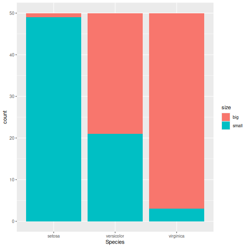
```
]
.panel[.panel-name[Chi-square]
```{r Chi_square}
chisq.test(table(demo_data$Species, demo_data$size))
```

]
.panel[.panel-name[summary]
```{r summary}
summary(table(demo_data$Species, demo_data$size))
```
]
.panel[.panel-name[Interpretation]
From the output we see that the p-value is less than the significance level of 5%,so, we can reject the null hypothesis.

In our context, rejecting the null hypothesis for the Chi-square test of independence means that there is a significant relationship between the two categorical variables (species and big or small petal length). Therefore, knowing the value of one variable helps to predict the value of the other variable.
]
]
???
Other available options
???
---

# Fisher’s Exact Test

Fisher’s exact test is used when the sample is small. The hypotheses of the Fisher’s exact test are the same than for the Chi-square test.

--

### assumptions
- The observations must be independent in order for the Fisher’s exact test to be valid
---

# Fisher’s Exact Test in R
.panelset[
.panel[.panel-name[Data]
```{r}
demo_data <- data.frame(
  "NonSmoker" = c(7, 0),
  "Smoker" = c(2, 5),
  row.names = c("Athlete", "NonAthlete"),
  stringsAsFactors = FALSE
)

demo_data

```

]
.panel[.panel-name[Visualize]
```{r fisher-s-exact_Plot, fig.show='hide'}
mosaicplot(demo_data,
  main = "Mosaic plot",
  color = TRUE
)
```

]
.panel[.panel-name[Plot]
```{r echo=FALSE, out.width="40%"}
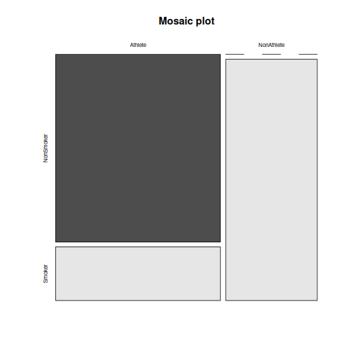
```

]
.panel[.panel-name[Fisher’s exact test]
```{r fisher-s-exact}
fisher.test(demo_data)
```
]
.panel[.panel-name[Interpretation]
From the output we see that the p-value is less than the significance level of 5%. Like any other statistical test, if the p-value is less than the significance level, we can reject the null hypothesis.

In our context, rejecting the null hypothesis for the Fisher’s exact test of independence means that there is a significant relationship between the two categorical variables (smoking habits and being an athlete or not). Therefore, knowing the value of one variable helps to predict the value of the other variable.
]
]
---
class: inverse, center, middle

# Inferential Statistics - Part 2
---
# Dataset to be explored
.panelset[
.panel[.panel-name[Data]
```{r message=FALSE, warning=FALSE}
library(tidyverse)
library(ggpubr)
load("../data/statistics_data.RData")
dataset
```
]
.panel[.panel-name[Visualize (ungrouped)]
```{r ungrouped_Plot, eval=FALSE}
ggplot(dataset, aes(x=income,
                    y=IQ)
       ) +
    geom_point(size=3) +
    theme_bw()
```

]
.panel[.panel-name[Plot (ungrouped)]
```{r echo=FALSE, out.width="40%"}
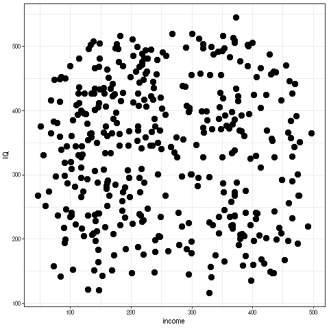
```

]

.panel[.panel-name[Interpretation]
There is not much of a relationship between parental income and child's measured IQ, except for a slight clumping in certain areas. 
]
]

---
# Dataset to be explored
.panelset[
.panel[.panel-name[Data]
```{r}
dataset
```
]

.panel[.panel-name[Visualize (groups: parental education)]
```{r parental_education_Plot, eval=FALSE}
ggplot(dataset, aes(x=income,
                    y=IQ,
                    color = parental_education)
       ) +
    geom_point(size=3) +
    scale_color_manual(values =  c(low="blue",
                                   high="yellow"
                                   )
                       )+
    theme_bw() ## white background
```
]

.panel[.panel-name[Plot (groups: parental education)]
```{r echo=FALSE, out.width="40%"}
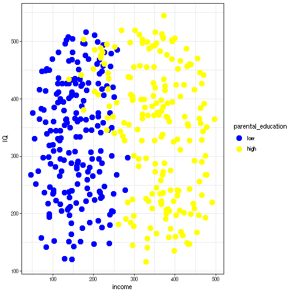
```

]

.panel[.panel-name[Interpretation]
**Parental_education is very strongly related to income**.
The **most likely explanation** here is that **it is the education which determines the income**. There is hardly any relation with child's measured IQ, except for one observation: there is a group of children whose parents had a higher education but have low income: All of these children have a high IQ.

This may hint at the importance of role models: in any social setting, if the parents are interested in learning, this may encourage the child to train his or her mental abilities, too.

]
]

---

# Dataset to be explored
.panelset[
.panel[.panel-name[Data]
```{r}
dataset

```

]
.panel[.panel-name[Visualize (groups: schooling_decision)]
```{r parental_income_Plot, eval=FALSE}
ggplot(dataset, aes(x=income,
                    y=IQ,
                    color = schooling_decision)
       ) +
    geom_point(size=3) +
    scale_color_manual(values =  c(secondary="blue",
                                   highschool="yellow"
                                   )
                       )+
    theme_bw() ## white background
```

]
.panel[.panel-name[Plot (groups: schooling_decision)]
```{r echo=FALSE, out.width="40%"}
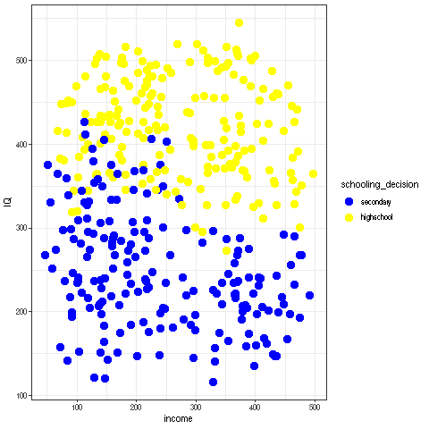
```

]
.panel[.panel-name[Interpretation]
**Schooling decision is very strongly related to IQ**, as it is expected if the decision is informed by the result of the IQ test.

**Note that for low-income parents, there is a tendency to send their children to secondary school even at quite high IQ values**. We have seen that low income typically goes with not having had a higher education. This hints at the **role of barriers**: Parents tend to keep their children in their own social sphere.


]
]
---
# Dataset to be explored
.panelset[
.panel[.panel-name[Data]
```{r}
dataset

```

]
.panel[.panel-name[Visualize (groups: crossed)]
```{r crossed_Plot, eval=FALSE}
ggplot(dataset,
       aes(x=income,
           y=IQ,
           color = group)
       ) +
    geom_point(size=3) +
    scale_color_manual(values =  c(`low|secondary`="lightblue",
                                   `low|highschool`="blue",
                                   `high|secondary`="orange",
                                   `high|highschool`="yellow")) +
    theme_bw() ## white background

```

]
.panel[.panel-name[Plot (groups: crossed)]
```{r echo=FALSE, out.width="40%"}
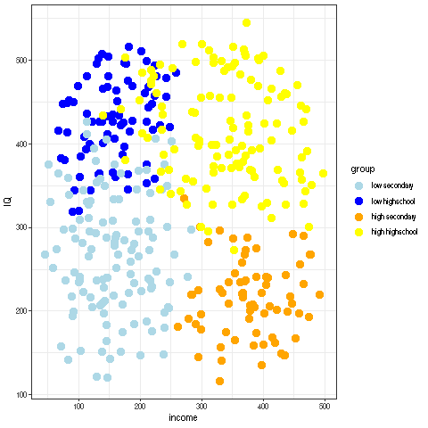
```

]
.panel[.panel-name[Interpretation]
.pull-left[
```{r echo=FALSE, out.width="85%"}

```
]
.pull-right[
Coloring by both grouping factors at once, it becomes obvious that **this dataset falls into quite sharply separated groups**.

In general, **secondary school is the default decision for parents without higher education, while highschool is the default for parents who attended highschool themselves**.
]
]
]
---
# Recapitulation: Chi-squared test
.panelset[
.panel[.panel-name[Data]
```{r}
## How many data points do we have in each group?
crosstab <- table(dataset$parental_education,
                  dataset$schooling_decision)

crosstab
```

]
.panel[.panel-name[Expected Counts]
```{r}
##     outer(x1,x2) returns a matrix:
##     x1[1] * x2[1] x1[1] * x2[2]
##     x1[2] * x2[1] x2[2] * x2[2]

outer(rowSums(crosstab),
      colSums(crosstab)
      ) / sum(crosstab)

```

]
.panel[.panel-name[Chi-squared test]
```{r}
chisq.test(crosstab)
```
]

.panel[.panel-name[Interpretation]
There is a clear preference for lowly educated parents to select secondary school for their child, and for highly educated parents to select highschool.

Given that there is no very obvious dependence of child's IQ on the education of the parents, this again points to the role of barriers and to the tendency to keep children in one's own social sphere.
]
]

---
# Comparing Group Means: Concepts
.panelset[
.panel[.panel-name[ANOVA: Are all means equal?]
```{r echo=FALSE, out.width="80%"}
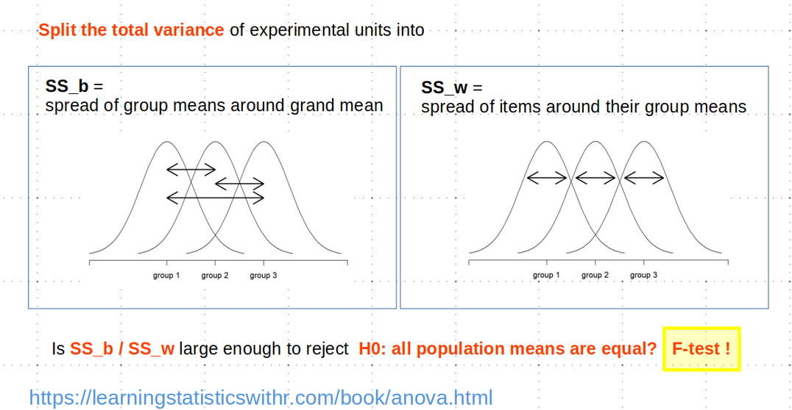

```
]
.panel[.panel-name[One-Sample t-Test]
```{r echo=FALSE, out.width="75%"}
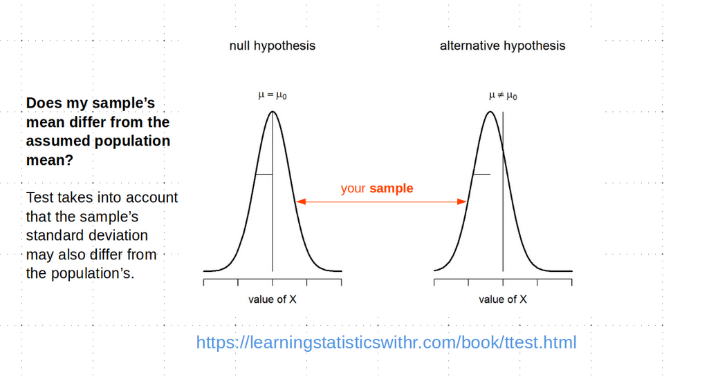

```
]

.panel[.panel-name[Independent Samples t-Test]
```{r echo=FALSE, out.width="75%"}
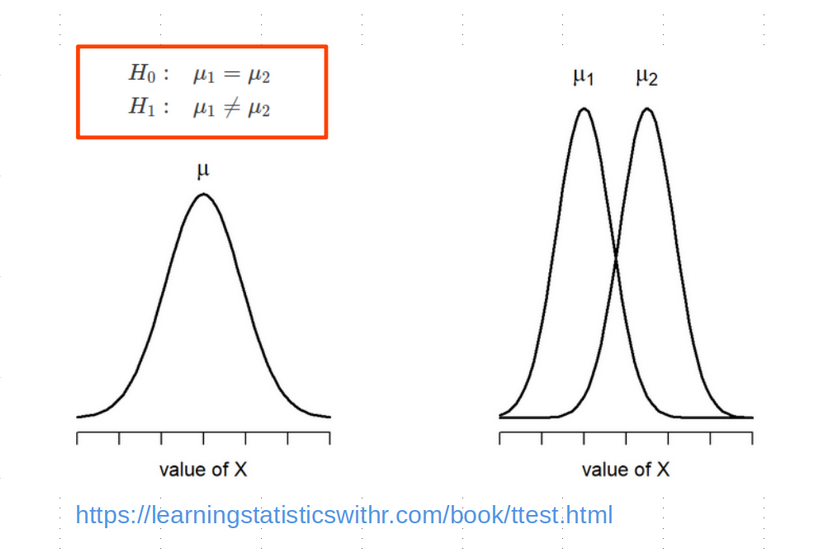

```
]
.panel[.panel-name[Paired Samples t-Test]
```{r echo=FALSE, out.width="75%"}
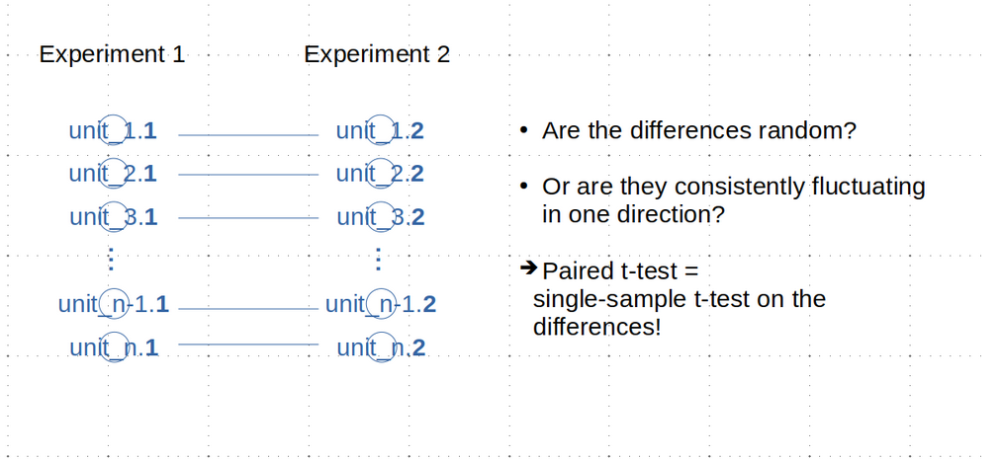

```
]
]
---
# Comparing Group Means: Assumptions
```{r echo=FALSE, out.width="80%"}
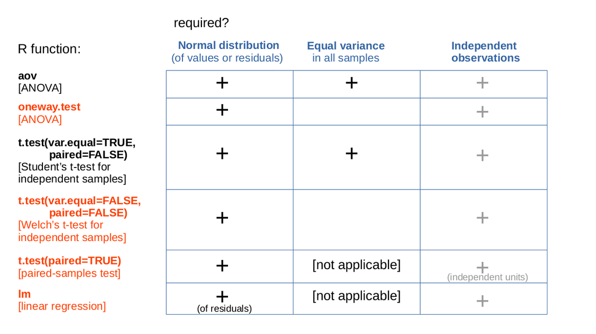
```
---
# Comparing Group Means: Workflow
```{r echo=FALSE, out.width="80%"}
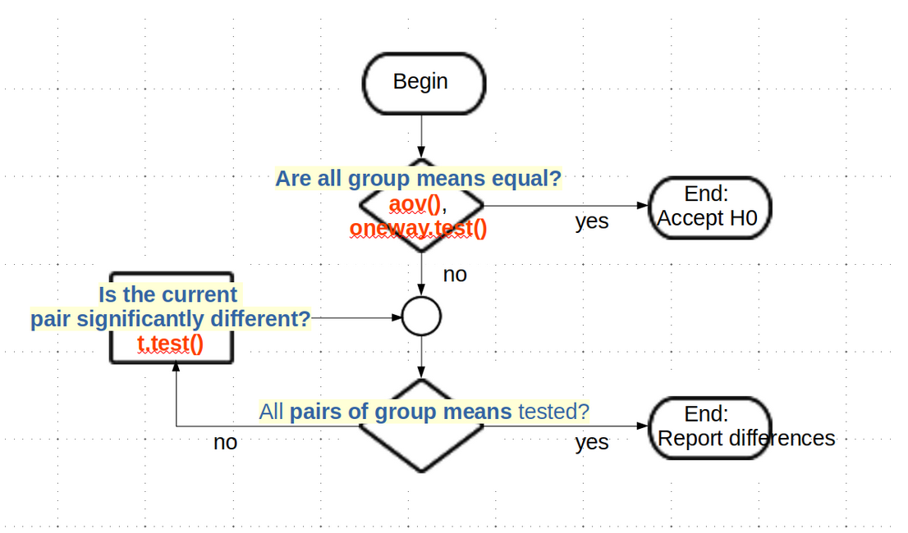
```
---
# Do the Assumptions Hold?
.panelset[
.panel[.panel-name[Normality of IQ: Q-Q Plot]
.pull-left[
```{r,echo = FALSE, out.width="85%"}
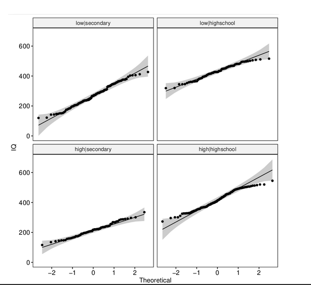
```
]
<br>
```{r echo=TRUE, eval=FALSE}
ggqqplot(dataset,"IQ",
         facet.by="group",
         ylab = "IQ")
```
<br>
The quantiles of the IQ distribution fall reasonably within the 95% confidence band, as they should (with the exception of high|highschool) at the extreme ends).
]
.panel[.panel-name[Q-Q Plot Concept]
.pull-left[
```{r,echo = FALSE, out.width="85%"}

```
]
<br>
- **x-axis** = theoretical quantiles of the Standard Normal distribution  

- **y-axis** of the line = quantiles of a sample [?of size equal to our sample?] from the Standard Normal distribution

- **quantile** = a value q, such that q% of the values of a distribution are <= q

- **y-axis** of the points: our sampled values

- **confidence band**: taking the sampling error into account, 95% of the reference Standard Normal sample is within this regionthe sampling error of the line's y-values  

]
.panel[.panel-name[Normality of IQ: Tests (Code) ]
```{r}
shapiro_results <- list()

for(this_group in levels(dataset$group)) {
    IQ_data <- dataset |>
                 dplyr::filter(group == this_group) |>
                 dplyr::pull(IQ)
    ## base R notation:
    ## IQ_data <- dataset$IQ[data$group == this_group]
    
    res <- shapiro.test(IQ_data)
    shapiro_results[["IQ"]][[this_group]] <- res
}

```
]
.panel[.panel-name[Normality of IQ: Tests (Results)]
.pull-left[
```{r,echo=FALSE}
shapiro_results[["IQ"]][1:2]
```
]
.pull-right[
```{r,echo=FALSE}
shapiro_results[["IQ"]][3:4]
```
]
]
]
---
# Do the Assumptions Hold?
.panelset[
.panel[.panel-name[Normality of Income: Q-Q Plot]
.pull-left[
```{r,echo = FALSE, out.width="85%"}
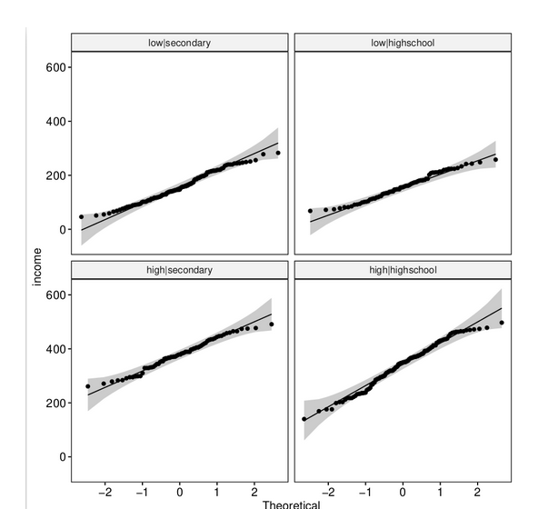
```
]
<br>
```{r echo=TRUE, eval=FALSE}
ggqqplot(dataset,"income",
         facet.by="group",
         ylab = "income")
```
<br>
As with IQ, the income values are reasonably within the 95% confidence bands.
]
.panel[.panel-name[Normality of Income: Tests]
```{r}

for(this_group in levels(dataset$group)) {
    income_data <- dataset |>
                     dplyr::filter(group == this_group) |>
                     dplyr::pull(income)
    ## base R notation:
    ## income_data <- dataset$income[data$group == this_group]
    
    res <- shapiro.test(income_data)
    shapiro_results[["income"]][[this_group]] <- res
}
```
]
.panel[.panel-name[Normality of Income: Tests (Results)]
.pull-left[
```{r,echo=FALSE}
shapiro_results[["income"]][1:2]
```
]
.pull-right[
```{r,echo=FALSE}
shapiro_results[["income"]][3:4]
```
]
]
]
---
# Do the Assumptions Hold?
.panelset[

.panel[.panel-name[Equal Variance in IQ]

```{r}
car::leveneTest(y = IQ ~ group, data = dataset)
```
]
.panel[.panel-name[Equal Variance in Income]
```{r}
car::leveneTest(y = income ~ group, data = dataset)
```
]
]
---
# Pairwise Equality of Means Tests (Code)
.panelset[
.panel[.panel-name[Prepare Pairwise Comparisons]
.pull-left[
.mediumtiny-code[
```{r}
## construct a comparison matrix
## function combn  creates all subsets of a set
comparisons <- combn(
    levels(dataset$group), ## the set to choose from
    2 ## we want subsets of size 2
)
## construct column  names for the resulting matrix:
colnames(comparisons) <- 
  apply(comparisons,
        2, ## traverse by column
        
        function(x) { 
          ## x takes the value of the current column
          
          ## construct and return the name
          paste0(x[1],"_vs_",x[2]) 
        }
      )
```
]
]
.pull-right[
.verytiny-code[
```{r}
comparisons
```
]
]
]
.panel[.panel-name[Run t.test on IQ (Code)]
```{r}
t_results_IQ <-
    apply(comparisons, ## a matrix, where each column
                       ## holds the names of the two 
                       ## groups to be compared
          2, ## traverse by column
          function(this_cmp) {
               IQ_1 <- dataset |> filter(group == this_cmp[1]) |> dplyr::pull(IQ)
               IQ_2 <- dataset |> filter(group == this_cmp[2]) |> dplyr::pull(IQ)
               t.test(
                   x = IQ_1,
                   y = IQ_2,
                   var.equal=FALSE
               )
          })
```
]
.panel[.panel-name[Run t.test on income (Code)]
```{r}
t_results_income <-
    apply(comparisons, ## a matrix, where each column
                       ## holds the names of the two 
                       ## groups to be compared
          2, ## traverse by column
          function(this_cmp) {
               income_1 <- dataset |> filter(group == this_cmp[1]) |> pull(income)
               income_2 <- dataset |> filter(group == this_cmp[2]) |> pull(income)
               t.test(
                   x = income_1,
                   y = income_2,
                   var.equal=FALSE
               )
          })
```
]
]
---
# Pairwise t-Test Results for IQ
.panelset[

.panel[.panel-name[Results 1]
```{r,echo=FALSE}
t_results_IQ[1]
```
]
.panel[.panel-name[Results 2]
```{r,echo=FALSE}
t_results_IQ[2]
```
]
.panel[.panel-name[Results 3]
```{r,echo=FALSE}
t_results_IQ[3]
```
]
.panel[.panel-name[Results 4]
```{r,echo=FALSE}
t_results_IQ[4]
```
]
.panel[.panel-name[Results 5]
```{r,echo=FALSE}
t_results_IQ[5]
```
]
.panel[.panel-name[Results 6]
```{r,echo=FALSE}
t_results_IQ[6]
```
]
.panel[.panel-name[Interpretation]
**Comparisons involving different school types are highly significant as expected**, because the schooling_decision had been based on the IQ value to a large part.

**Within a given school type, there is a significant difference between the mean IQ values of children sent to secondary school by lowly versus highly educated parents (Results 2)**, but no significant difference for children sent to highschool by lowly versus highly educated parents (Results 5). This again hints at a barrier effect: lowly educated parents consider highschool only
at really high IQ values.
]
]
---
# Pairwise Tests t-Test Results Income
.panelset[
.panel[.panel-name[Results 1]
```{r,echo=FALSE}
t_results_income[1]
```
]
.panel[.panel-name[Results 2]
```{r,echo=FALSE}
t_results_income[2]
```
]
.panel[.panel-name[Results 3]
```{r,echo=FALSE}
t_results_income[3]
```
]
.panel[.panel-name[Results 4]
```{r,echo=FALSE}
t_results_income[4]
```
]
.panel[.panel-name[Results 5]
```{r,echo=FALSE}
t_results_income[5]
```
]
.panel[.panel-name[Results 6]
```{r,echo=FALSE}
t_results_income[6]
```
]
.panel[.panel-name[Interpretation]
As expected, **any comparison involving highly versus lowly educated parents is highly significant**, because education has a large influence on income. 

Results 1 and 6 compare the incomes of parents at the same education level, but with different schooling decisions. While for lowly educated parents (Results 1) income is uncorrelated with  schooling_decision, **highly educated parents tend to have a slightly higher income if they send their child to secondary school rather than to highschool (p=0.0002)** -- a somewhat unexpected result.
]
]
---
# Pairwise Tests with ggboxplot (IQ)
.panelset[
.panel[.panel-name[Code]
```{r, message = FALSE}

p <- ggboxplot(dataset, x = "group", y = "IQ",
               
          color = "group", palette = c("lightblue", "blue","orange", "yellow"),
          order = levels(dataset$group),
          ylab = "IQ", xlab = "group") +

    stat_compare_means(method = "t.test",
                       method.args = list(var.equal = FALSE),
                       ## The "comparisons" argument expects a list consisting
                       ## of vectors of length 2, i.e.
                       ## a list of the columns of our "comparisons" matrix.
                       ## Trick to do the conversion:
                       ## First convert the matrix to a data.frame, which is implicitly a list,
                       ## then convert the data.frame to an explicit list:
                       comparisons = comparisons|> as.data.frame() |> as.list()
    )
invisible(NULL) ## trick to prevent plotting the figure already here
```
]
.panel[.panel-name[Plot]
.pull-left[
```{r,echo = FALSE, out.width="80%"}
#png("../images/ggbpIQ.png")
#print(p); rm(p)
#dev.off()
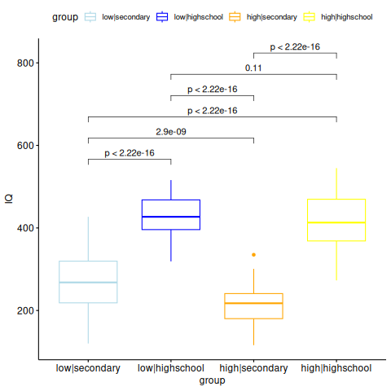
#invisible(NULL) ## but the plot appears still also as output,
##outside of the page
```
]
.pull-right[
The visual representation makes the points noted above more clear:

- in comparisons involving different schooling decisions, IQ differs with high significance

- in the two comparisons with the same schooling decision but different parental_education values
    + the IQ differences are generally much smaller
    + the difference is nevertheless significant for parents with low education
    
The last observation may suggest that these parents consider highschool rather than secondary school only for very smart children (barrier effect).
]
]
]
---
# Pairwise Tests with ggboxplot (income)
.panelset[
.panel[.panel-name[Code]
```{r, message = FALSE}

p <- ggboxplot(dataset, x = "group", y = "income",
               
          color = "group", palette = c("lightblue", "blue","orange", "yellow"),
          order = levels(dataset$group),
          ylab = "income", xlab = "group") +

    stat_compare_means(method = "t.test",
                       method.args = list(var.equal = FALSE),
                       ## The "comparisons" argument expects a list consisting
                       ## of vectors of length 2, i.e.
                       ## a list of the columns of our "comparisons" matrix.
                       ## Trick to do the conversion:
                       ## First convert the matrix to a data.frame, which is implicitly a list,
                       ## then convert the data.frame to an explicit list:
                       comparisons = comparisons|> as.data.frame() |> as.list()
    )
#invisible(NULL) ## trick to prevent plotting the figure already here
```
]
.panel[.panel-name[Plot]
.pull-left[
```{r,echo = FALSE, out.width="80%"}
#png("../images/ggbpIncome.png")
#print(p); rm(p)
#dev.off()
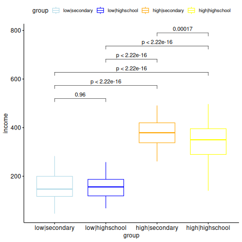
#invisible(NULL) ## but note that the plot appears still also as output,
##outside of the page!! Can this cause trouble?
```
]
.pull-right[

Note as observed below:

- in comparisons involving different parental education levels, income differs with high significance

- of the comparisons within one parental education level, only high|secondary and high|highschool differ significantly, with the former having a bit higher income than the latter 

]
]
]
---
# Preparing to Compare IQ to IQ_after_1y
.panelset[
.panel[.panel-name[Original Data]
Next **we will do a paired t-test**, comparing the originally measured IQ value to the value measured after one year at the school chosen by the parents. 

The **t.test()** function compares two vectors, so our **original dataset would be structured OK** for running the test on the columns IQ and IQ_after_1y, grouped by column "group":
```{r, echo=FALSE}
head(dataset,n=3)
```
However, the **ggboxplot()** function expects a **single data vector plus a second vector identifying the groups to be compared**. This gives us the chance to do some **data wrangling**!
]
.panel[.panel-name[Transformation(1)]

The values of columns IQ and the IQ_after_1y will be merged in the **data vector**. 

A **grouping vector** will hold the name of each value's column of origin:


```{r}
## Rearrange the data table:
data_long <- dataset |>
               tidyr::pivot_longer(cols = c(IQ,IQ_after_1y),
                                   names_to = "measurement", 
                                   values_to = "IQ_value")

                                                
```
```{r, echo=FALSE}
head(data_long, n=4)
```
]
.panel[.panel-name[Transformation(2)]

**The column of origin is not enough if we want to trace each value back to the "group" column it belonged to**. A simple solution is to prepend the group names to the measurement values:


```{r}
data_long <- data_long |>  
  mutate(measurement = 
           paste(group,
                 measurement,sep="_"))
```

.tiny-code[
```{r, echo=FALSE}
head(data_long)
```
]
]
.panel[.panel-name[Transformation(3)]

Next we make the new "measurement" column a factor, with a defined order of levels:
```{r}

data_long <- data_long |>  
  mutate(measurement = 
           factor(measurement, # set factor levels 
                levels=
                c("low|secondary_IQ","low|secondary_IQ_after_1y",
                  "low|highschool_IQ","low|highschool_IQ_after_1y",
                  "high|secondary_IQ","high|secondary_IQ_after_1y" ,
                  "high|highschool_IQ","high|highschool_IQ_after_1y"
                  )
               ))

```
]
]
---
# Preparing to Compare IQ to IQ_after_1y
.panelset[

.panel[.panel-name[Transformation(4)]
**We want to compare "IQ"s and "IQ_after_1y"s within each group, but so far coloring is solely by group, not by time point**. Here we append a "4" to the colors of "IQ_after_1y" values, which makes them a bit darker.
.mediumtiny-code[
```{r}
data_long <-
    data_long |> mutate(plot_color=
                          if_else(grepl("_after_1y$",
                                        measurement),
                                  paste0(plot_color,"4"),
                                  plot_color)
                          )

# same in base R (a little bit simpler):
# data_long$plot_color <- ifelse(grepl("_after_1y$",
#                                      measurement
#                                      ),
#                                paste0(data$plot_color,"4"),
#                                data$plot_color)
```
]
]
.panel[.panel-name[Long Data]
.tiny-code[
```{r}
data_long
```
]
]
.panel[.panel-name[Color Palette]
Finally we make a color palette for the ggboxplot, associating colors (a vector) with the corresponding levels of the "measurements" factor:

.mediumtiny-code[
```{r}
## find the unique pairings of  (a) "plot_color" and (b) a "measurement" level -- 
## In base R:
d <- unique(data_long[,c("plot_color","measurement")])
## make (b) the vector element names of (a)
colors_long <- setNames(d$plot_color,d$measurement)

## In tidyverse style .. more complex:
colors_long <- (data_long |>
    select(plot_color,measurement) |>
    unique() |>
    tibble::column_to_rownames("measurement")  |>
    as.matrix()
)[,1]
```
]
]
]
---
# Paired t-Test: IQ Change After One Year
.panelset[
.panel[.panel-name[The Comparisons We Want to Make]
```{r, echo = FALSE}
pairwise_comparisons <- matrix(levels(data_long$measurement),
                               nrow=2)
## set column names:
colnames(pairwise_comparisons) <- apply(pairwise_comparisons,
                                        2, 
                                        function(x) { 
                                            paste0(x[1],"_vs_",x[2]) 
                                        })
pairwise_comparisons
```
]
.panel[.panel-name[Plotting Code]
```{r}
p <- 
  ggboxplot(data_long, x = "measurement", y = "IQ_value", 
            color = "measurement", 
            palette = colors_long,
            order = levels(data_long$measurement),
            ylab = "IQ", xlab = "group") +

    stat_compare_means(method = "t.test",
                       ## convert matrix columns to list elements:
                       comparisons = pairwise_comparisons|> 
                         as.data.frame() |> as.list(),
                       paired = TRUE ## pairwise test!
                       )


#invisible(NULL) ## trick to prevent plotting the figure already here
```
]
.panel[.panel-name[Plot]
.pull-left[
```{r,echo = FALSE, out.width="80%"}
#png("../images/ggbpIQ_change.png")
#print(p + theme(axis.text.x = element_blank())); rm(p)
#dev.off()
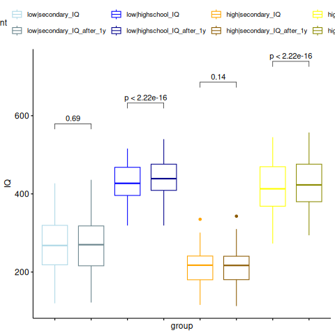
#invisible(NULL) 
```
]
.pull-right[
The IQ measured after one year at the new school  is clearly higher than IQ at schooling decision **only for children attending highschool**. This effect does not depend on parental education.  
]
]
]


---
# Linear Regression: Concepts
.panelset[
.panel[.panel-name[Simple Linear Regression]
```{r echo=FALSE, out.width="90%"}
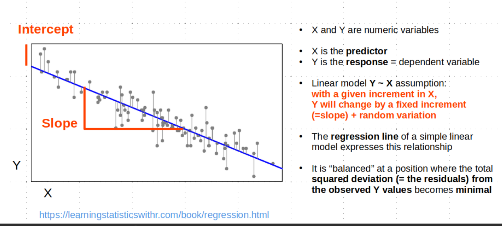
```
]
.panel[.panel-name[Multiple Linear regression]
```{r echo=FALSE, out.width="80%"}
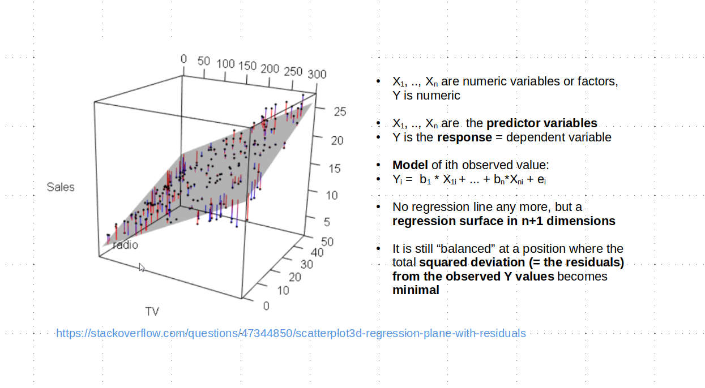
```
]
.panel[.panel-name[Anova/t_Test and Linear Regression]
- **Both Anova/t-test and Linear Regression test hypotheses about structure in the observations**:
    + Anova/t-test: group structure
    + Linear regression: presence of predictor variables which induce non-randomness

- **There is a deep mathematical relationship between the two approaches** (not to be explored here): 
    + Regression models use the **t-statistic** to test the effect of a predictor on the dependent variable. 
    + Regression models use The **F-statistic** known from Anova to express the overall fit of a linear model, and to test whether an additional predictor truly improves a model or should better be left out.  
]
]
---
# Simple LR: IQ vs Income in low|highschool
.panelset[
.panel[.panel-name[Data]
```{r}
low_highschool <- subset(dataset, group == "low|highschool")
low_highschool
```
]
.panel[.panel-name[Code]
```{r}
fit1 <- lm(IQ ~ income, low_highschool)
```
]
.panel[.panel-name[Results]
.tiny-code[
```{r}
summary(fit1)
```
]
]
.panel[.panel-name[Interpretation]
```{r,echo=FALSE, out.width="95%"}
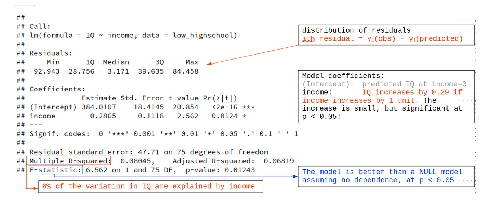
```
]
.panel[.panel-name[Diagnostic Plots]
.pull-left[
.tiny-code[
```{r,eval=FALSE}
layout(matrix(1:4,nrow=2,byrow=TRUE))
plot(fit1,which=1)
plot(fit1,which=2)
plot(fit1,which=3)
plot(fit1,which=5)
layout(1)

## These four diagnostic plots are shown
## by default if you simply type
plot(fit1)
## and hit return to see the next plot.
## There are 6 different diagnostic plots
## in total. They can be individually 
## selected by the "which" parameter.

## Standardized residual_i = residual_i / stdError_i
## (absolute value is used on scale-location plot)

## Leverage_i = a measure of how much  the 
## i_th observation influences the regression line. 
```
]
]
.pull-right[
```{r,echo=FALSE, out.width="85%"}
layout(matrix(1:4,nrow=2,byrow=TRUE))
plot(fit1,which=1)
plot(fit1,which=2)
plot(fit1,which=3)
plot(fit1,which=5)
layout(1)
```

]
]
]
---
# Multiple LR: Role of "group: in IQ ~ income
.panelset[
.panel[.panel-name[Code]
```{r}
fit2 <- lm(IQ ~ income + group, dataset)
```
]
.panel[.panel-name[Results]
.tiny-code[
```{r}
summary(fit2)
```
]
]
.panel[.panel-name[Interpretation]
```{r,echo=FALSE, out.width="90%"}
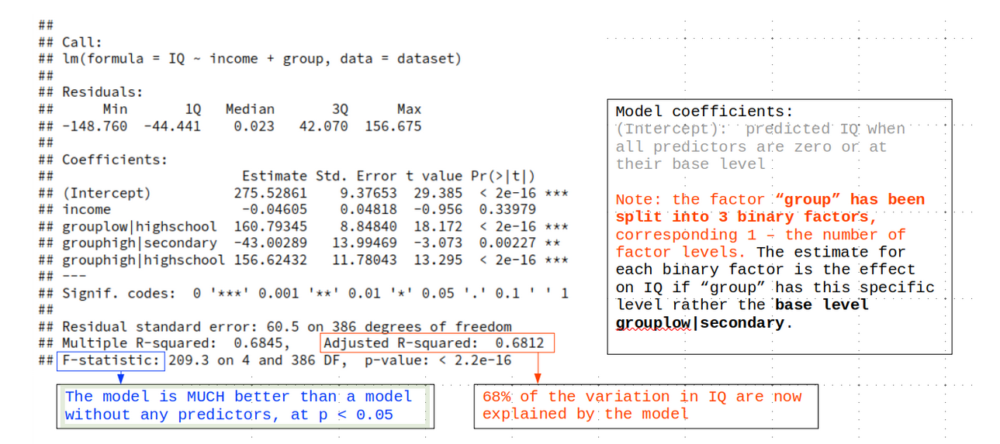
```
]
.panel[.panel-name[F-Statistic For Model Comparison]
The F-statistic in the model summaries compares the predictive power of the model to the NULL model without any predictors, using an ANOVA framework. Function **anova()** can do this for any two models. Let us compare the fit2 model to a model on the full data with income as the only predictor:

```{r}
fit0 <- lm(IQ ~ income, dataset) ## now not restricted to one group level!
anova(fit0, fit2)
```

As expected, including "group" improves the model greatly.
]
.panel[.panel-name[Diagnostic Plots]
.pull-left[
.tiny-code[
```{r,eval=FALSE}
layout(matrix(1:4,nrow=2,byrow=TRUE))
plot(fit2,which=1)
plot(fit2,which=2)
plot(fit2,which=3)
plot(fit2,which=5)
layout(1)

## Because the regression is now actually done in 3D space, the diagnostic 2D plots are no longer that easy to interpret. What is important is the normality of the residuals (plot 2) and an approximately horizontal red line in the last two plots.
```
]
]
.pull-right[
```{r,echo=FALSE, out.width="85%"}
layout(matrix(1:4,nrow=2,byrow=TRUE))
plot(fit2,which=1)
plot(fit2,which=2)
plot(fit2,which=3)
plot(fit2,which=5)
layout(1)
```

]
]
]
---
# We Are Done --- Except for a Confession ...
----
---
# We Are Done --- Except for a Confession ...
----
## We found a lot of structure in this dataset, didn't we?

### Structure can have the most unexpected causes ...
---
# We Are Done --- Except for a Confession ...
----
```{r echo=FALSE, out.width="90%"}
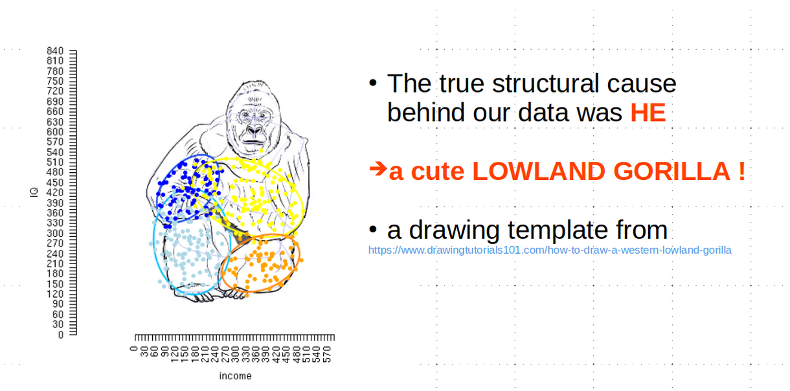
```
---
# We Are Done --- Except for a Confession ...
----
#### You may be interested in reading this paper and the follow-up papers discussing it:
```{r echo=FALSE, out.width="75%"}
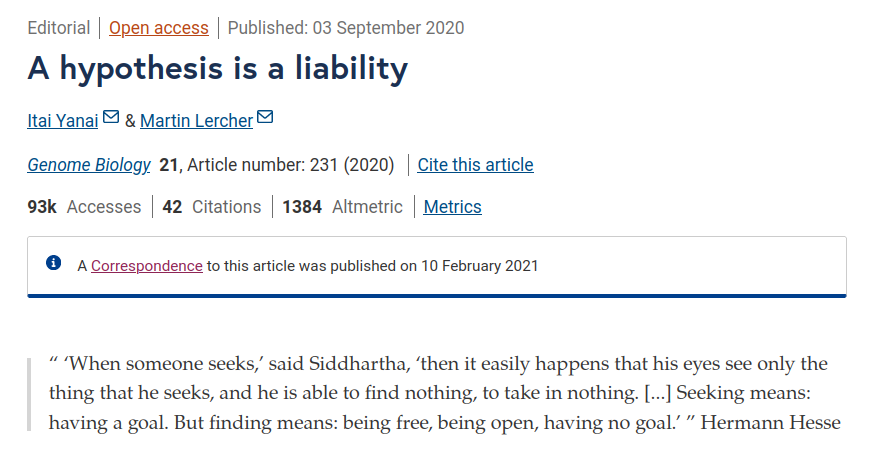
```

---
class: inverse, center, middle

# Session 3: Principal Component Analysis & Hierarchical Clustering

---
## Principal Component Analysis (PCA) - Overview

.panelset[

.panel[.panel-name[What is PCA?]

.pull-left[
**Principal Component Analysis (PCA)** is a **linear** dimensionality reduction technique that transforms high-dimensional data into a lower-dimensional space by finding **new, uncorrelated axes** (called **principal components**) that **maximize the variance** in the data.
- **Dimensionality Reduction**: PCA sets the focus on just a few components and
their corresponding genes, which contribute the most to the variation in the data.
- **Applications**: PCA is widely used in gene expression data (e.g., RNA-Seq) to 
identify patterns, reduce noise, and cluster samples based on similar gene 
expression profiles.

]
.pull-right[

<div class="image-with-caption">
  
  <p class="caption"><font size="3"><b>source:</b> PMID: 34440590 </font></p>
</div>

]

]


.panel[.panel-name[Applications of PCA]


.pull-left[
- **Data Visualization**  
  - Reduce high-dimensional data to 2D/3D for easy interpretation  
  - Capture main sources of variation
- **Batch Effect Detection**  
  - Detect (and remove technical) variability between experiments  
  - Improve biological signal clarity
- **Population Genetics**  
  - Visualize genetic diversity and ancestry  
  - Identify population structure and relationships
  ]
  
.pull-right[
- **Noise Reduction & Preprocessing**  
  - Discard irrelevant data and noise  
  - Clean and compress data for further analysis (e.g., clustering)
- **Feature Selection**  
  - Identify the most informative genes or variables  
  - Focus on principal components that capture the most variance
- **Gene Expression Analysis**  
  - Uncover patterns in large datasets (RNA-Seq, microarrays)  
  - Cluster samples by expression profiles (e.g., healthy vs. diseased)
  ]
]


.panel[.panel-name[Steps in PCA]


.pull-left[
1. **Standardize the Data**:
   - Biological data may vary in scale (e.g., gene expression values), so data should be standardized (mean = 0, variance = 1).
2. **Compute Covariance Matrix**:
   - Determine how the variables (genes) relate to each other.
3. **Eigenvectors and Eigenvalues**:
   - **Eigenvectors** are the directions of the maximum variance (the PCs).
   - **Eigenvalues** tell us how much of the variance each PC explains.
4. **Select Principal Components**:
   - Choose the number of PCs to retain, usually based on the total variance explained (e.g., 90% of variance).
]

.pull-right[

<div class="image-with-caption">
  
  <p class="caption"><font size="3"><b>source:</b> Iris dataset </font></p>
</div>


]

]


.panel[.panel-name[Interpreting PCA]
.pull-left[
- **Principal Components**: The first few PCs capture the majority of the variance in the data.
- **Loadings**: Each PC is a linear combination of the original variables (genes). The loadings tell us which genes contribute most to each PC.
- **Biological Meaning**:
   - PC1 might represent major biological differences (e.g., healthy vs. diseased).
   - PC2 could capture subtler differences.
   - PC1 is sometime not Component of interest (!!). 
]
.pull-right[

<div class="image-with-caption">
  
  <p class="caption"><font size="3"><b>source:</b> https://satijalab.org/seurat/articles/pbmc3k_tutorial.html </font></p>
</div>
]
]
]

---

## Principal component analysis in R

.panelset[

.panel[.panel-name[Data]
```{r}

## Load and display the data
data("iris")

head(iris)
```
We will use the **iris** dataset, which contains measurements of four features (Sepal Length, Sepal Width, Petal Length, Petal Width) for three species of flowers.
]

.panel[.panel-name[Perform PCA]
```{r}
## Perform PCA on the iris dataset
pca_result <- prcomp(iris[, -5], scale. = TRUE)

summary(pca_result)
```
We perform **Principal Component Analysis (PCA)** on the **iris** dataset, excluding the species column. PCA helps reduce the dataset's dimensionality while retaining most of its variance.
]

.panel[.panel-name[Scatterplot (PC1 vs PC2)]

.pull-left[

```{r echo=F}
library(ggplot2)
```

```{r echo=T, fig.show="hide"}
pca_scores <- as.data.frame(pca_result$x)
ggplot(pca_scores, 
       aes(PC1, PC2, color = iris$Species)) +
  geom_point(size = 3) +
  ggtitle("PCA Scatterplot (PC1 vs PC2)") +
  xlab(
    paste("PC1 (", 
    round(
    summary(pca_result)$importance[2,1] * 100, 1),
    "% variance)")) +
  ylab(
    paste("PC2 (",
    round(
    summary(pca_result)$importance[2,2] * 100, 1),
    "% variance)")) +
  theme_minimal()
```
]


.pull-right[
```{r echo=F, fig.width=7, fig.height=5}
## PCA Scatterplot using ggplot2
library(ggplot2)
pca_scores <- as.data.frame(pca_result$x)
ggplot(pca_scores, aes(PC1, PC2, color = iris$Species)) +
  geom_point(size = 3) +
  ggtitle("PCA Scatterplot (PC1 vs PC2)") +
  xlab(paste("PC1 (", round(summary(pca_result)$importance[2,1] * 100, 1), "% variance)")) +
  ylab(paste("PC2 (", round(summary(pca_result)$importance[2,2] * 100, 1), "% variance)")) +
  theme_minimal()

```

]


This scatterplot shows how samples (flower species) cluster based on the first two principal components. **PC1** explains the most variance, followed by **PC2**.
]

.panel[.panel-name[Variance Explained]


.pull-left[
```{r echo=T, fig.show="hide"}
## Calculate explained variance
eigenvalues <- pca_result$sdev^2
explained_variance <- eigenvalues / sum(eigenvalues)
cumulative_variance <- cumsum(explained_variance)

# Plot explained variance
explained_variance_df <- data.frame(
  PC = factor(paste0("PC", 1:4), levels = paste0("PC", 1:4)),
  Proportion = explained_variance
)

ggplot(explained_variance_df, aes(x = PC, y = Proportion)) +
  geom_bar(stat = "identity", fill = "steelblue") +
  ggtitle("Proportion of Variance Explained") +
  xlab("Principal Component") +
  ylab("Proportion of Variance") +
  theme_minimal()
```
]

.pull-right[
```{r echo=F, fig.width=6, fig.height=5}
## Calculate explained variance
eigenvalues <- pca_result$sdev^2
explained_variance <- eigenvalues / sum(eigenvalues)
cumulative_variance <- cumsum(explained_variance)

# Plot explained variance
explained_variance_df <- data.frame(
  PC = factor(paste0("PC", 1:4), levels = paste0("PC", 1:4)),
  Proportion = explained_variance
)

ggplot(explained_variance_df, aes(x = PC, y = Proportion)) +
  geom_bar(stat = "identity", fill = "steelblue") +
  ggtitle("Proportion of Variance Explained") +
  xlab("Principal Component") +
  ylab("Proportion of Variance") +
  theme_minimal()
```
]

The **Proportion of Variance Explained** plot shows how much variance is captured by each principal component.
]

.panel[.panel-name[Scree Plot]

.pull-left[
```{r echo=T, , fig.show="hide"}
## Scree plot showing cumulative variance explained
cumulative_variance_df <-
  data.frame(
    PC = 1:4,
    CumulativeVariance = cumulative_variance
)

ggplot(cumulative_variance_df, 
       aes(x = PC,
           y = CumulativeVariance)) +
  geom_line(group = 1, color = "steelblue") +
  geom_point(size = 3, color = "steelblue") +
  ggtitle("Cumulative Variance Explained") +
  xlab("Principal Component") +
  ylab("Cumulative Variance") +
  scale_y_continuous(limits = c(0, 1)) +
  theme_minimal()
```
]

.pull-right[
```{r echo=F, fig.width=6, fig.height=5}
## Scree plot showing cumulative variance explained
cumulative_variance_df <- 
  data.frame(
    PC = 1:4,
    CumulativeVariance = cumulative_variance
)

ggplot(cumulative_variance_df,
       aes(x = PC, 
           y = CumulativeVariance)) +
  geom_line(group = 1, color = "steelblue") +
  geom_point(size = 3, color = "steelblue") +
  ggtitle("Cumulative Variance Explained") +
  xlab("Principal Component") +
  ylab("Cumulative Variance") +
  scale_y_continuous(limits = c(0, 1)) +
  theme_minimal()
```
]

This **Scree Plot** helps determining how many PCs are needed to explain most of the data’s variance.
]


]

---

## Hierarchical Clustering - Overview

.panelset[
.panel[.panel-name[What?]
.pull-left[
**Hierarchical Clustering** is an **unsupervised** machine learning technique used to group data into clusters based on similarity, creating a hierarchy of clusters. It builds a **tree-like structure** (dendrogram) that represents nested clusters at various levels.
- **Agglomerative Method**: Each data point starts as its own cluster, and pairs of clusters are merged based on their similarity until one large cluster forms.
- **Divisive Method**: The reverse process, where one large cluster is split recursively into smaller clusters.
]
.pull-right[
<div class="image-with-caption">
  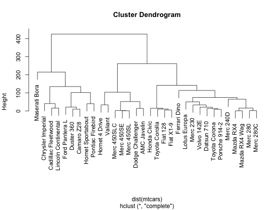
  <p class="caption"><font size="3"><b>source:</b> https://www.gastonsanchez.com/visually-enforced/how-to/2012/10/03/Dendrograms/ </font></p>
</div>
]
]

.panel[.panel-name[Applications]
.pull-left[
- **Gene Expression Analysis**
  - Group genes or samples based on expression profiles  
  - Identify clusters of similar expression patterns (e.g., healthy vs. diseased)
- **Customer Segmentation**
  - Group customers into distinct clusters based on purchasing behavior  
  - Find patterns in customer demographics and preferences
- **Document Clustering**
  - Group similar documents based on content similarity  
  - Useful in text mining and information retrieval
]
.pull-right[
- **Image Segmentation**
  - Cluster similar pixels in an image  
  - Separate objects or regions based on color or intensity
- **Pattern Recognition**
  - Group data points with similar characteristics  
  - Useful in applications like facial recognition or biometrics
- **Marketing Analysis**
  - Understand market segments and target specific groups of customers  
  - Create personalized marketing strategies based on clustering
]
]

.panel[.panel-name[Algorithm]
.pull-left[
1. **Calculate Distance Matrix**:
   - Measure the distance (e.g., Euclidean) between every pair of data points.
2. **Choose a Linkage Method**:
   - **Single Linkage**: Merge clusters based on the closest pair of points.
   - **Complete Linkage**: Merge based on the farthest pair of points.
   - **Average Linkage**: Merge based on the average distance between points.
3. **Build the Dendrogram**:
   - Recursively merge clusters and represent the process in a tree structure.
4. **Cut the Dendrogram**:
   - Choose a threshold to determine the number of clusters.
]

.pull-right[
<div class="image-with-caption">
  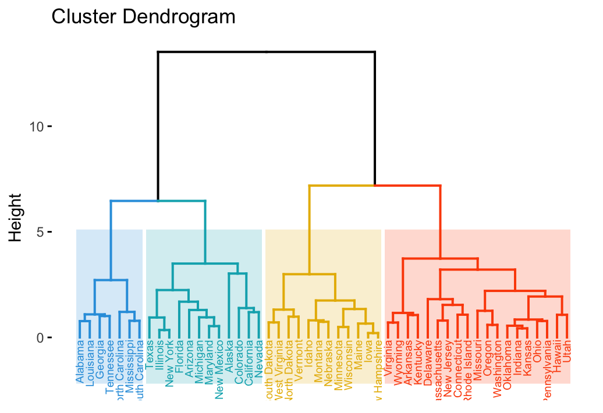
  <p class="caption"><font size="3"><b>source:</b> https://www.datanovia.com/en/lessons/examples-of-dendrograms-visualization/ </font></p>
</div>
]
]

.panel[.panel-name[Interpretation]
.pull-left[
- **Dendrogram**: A tree-like diagram that shows the sequence of cluster merges. The height at which two clusters are joined represents their similarity (shorter links indicate more similar clusters).
- **Clusters**: You can choose how many clusters to create by cutting the dendrogram at a certain height. 
- **Biological Meaning**:
   - Clusters can group samples or genes with similar biological characteristics.
   - Patterns may help in identifying disease subtypes, evolutionary relationships, or functional similarities.
]
.pull-right[

<div class="image-with-caption" height="600">
  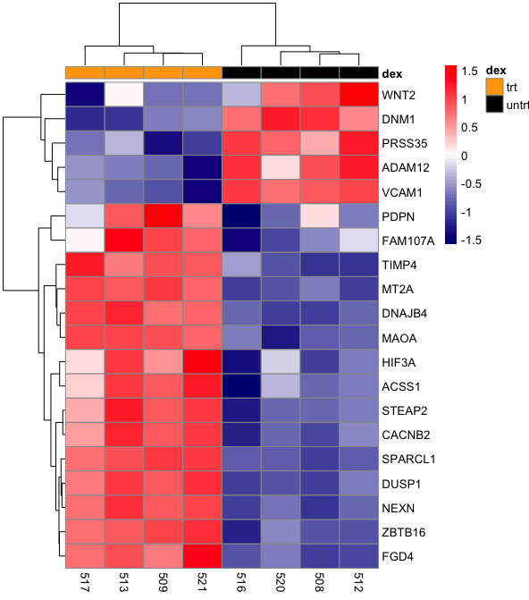
  <p class="caption"><font size="3"><b>source:</b> https://bioinformatics.ccr.cancer.gov/docs/data-visualization-with-r/Lesson5_intro_to_ggplot/ </font></p>
</div>
]
]
]
---

## Hierarchical Clustering in R

.panelset[


.panel[.panel-name[Data]
```{r}
## Load and display the data
data("iris")
head(iris)
```
We will use the **iris** dataset, which contains measurements of four features (Sepal Length, Sepal Width, Petal Length, Petal Width) for three species of flowers.
]

.panel[.panel-name[Perform Hierarchical Clustering]
.pull-left[
```{r fig.width=10, fig.height=15, fig.show="hide"}
## Calculate the distance matrix & 
## perform hierarchical clustering
distance_matrix <- dist(iris[, -5])
hclust_result <- 
  hclust(distance_matrix,
         method = "complete")
# Plot the dendrogram
plot(hclust_result,
     labels = iris$Species,
     main = "Dendrogram of Iris Dataset")
```
We perform **Hierarchical Clustering** on the **iris** dataset using the complete linkage method. The dendrogram shows how the data points are grouped.
]
.pull-right[
```{r echo=F, fig.width=12, fig.height=8}
## Calculate the distance matrix & 
## perform hierarchical clustering
distance_matrix <- dist(iris[, -5])
hclust_result <- 
  hclust(distance_matrix,
         method = "complete")
# Plot the dendrogram
plot(hclust_result,
     labels = iris$Species,
     main = "Dendrogram of Iris Dataset")
```
]
]

.panel[.panel-name[Heatmap with Dendrogram]
.pull-left[
```{r fig.show="hide"}
## Create a heatmap with hierarchical clustering
library(pheatmap)
# Define annotation colors for species
annotation_colors <- list(
  Species = c(setosa = "red", 
              versicolor = "blue", 
              virginica = "green")
)
# Perform hierarchical clustering
pheatmap(as.matrix(iris[, -5]), 
         clustering_distance_rows = "euclidean", 
         annotation_colors = annotation_colors, 
         clustering_method = "complete", 
         annotation_col = iris["Species"], 
         main = "Heatmap with Dendrogram")
```

]
.pull-right[
```{r echo=F, fig.width=10, fig.height=6}
## Heatmap using hierarchical clustering
library(pheatmap)
annotation_colors <- list(
  Species = c(setosa = "red", versicolor = "blue", virginica = "green")
)
# Perform hierarchical clustering
pheatmap(as.matrix(iris[, -5]), clustering_distance_rows = "euclidean", annotation_colors = annotation_colors, clustering_method = "complete", annotation_col = iris["Species"], main = "Heatmap with Dendrogram")
```

The heatmap shows the clustering of samples and features along with a dendrogram, which helps identify the groupings.
]
]

.panel[.panel-name[Choosing the Number of Clusters]
.pull-left[
```{r message=F}
library(dplyr)
## Cut the dendrogram to obtain clusters
cutree(hclust_result, k = 3) %>% table()
```
You can choose the number of clusters by cutting the dendrogram at a certain height. Here, we cut the dendrogram into **3 clusters**.
The colored rectangles show the division into 3 clusters, based on the dendrogram structure.
This approach allows you to select the number of clusters that best fits your data, based on the hierarchical clustering method.
]
.pull-right[
```{r fig.height=4,fig.height=4}
## Visualizing clusters
cluster_labels <- cutree(hclust_result,  k = 3)
plot(hclust_result)
rect.hclust(hclust_result, k = 3, border = 2:4)
```


]
]

]